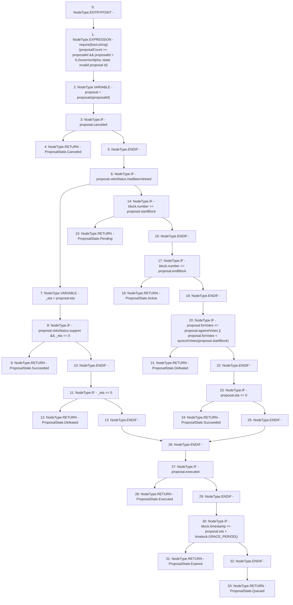

# Context: GovernorAlpha.state

**Contract:** `GovernorAlpha` (Inherits: None)
**Signature:** `state(uint256) returns (GovernorAlpha.ProposalState)`
**Method Selector ID:** `0x3e4f49e6`
**Visibility:** `public`
**Environment-Free:** `No (reads EVM state context)`
**Modifiers:** None

### State Variables Interaction
- **Reads:** proposalCount, proposals, timelock
- **Writes:** None

### Assertion Checks & Business Requirements
- require/assert: `require(bool,string)(proposalCount >= proposalId && proposalId > 0,GovernorAlpha::state: invalid proposal id)`

### Environment & Verification Flags
- **Uses Foundry Cheatcodes:** No
- **Has Echidna Properties:** No

### Internal Calls Tree
- None

### External Calls / Value Transfers
- `ITimelock.TMP_33(uint256) = HIGH_LEVEL_CALL, dest:timelock(ITimelock), function:GRACE_PERIOD, arguments:[]  `

### Control Flow Graph (CFG)


### Source Mapping
Declared in: `certora-ac-datasets/detasets/web3bugs/dataset/web3bugs/52/contracts/governance/GovernorAlpha.sol` on lines **279** to **319**

```solidity
    function state(uint256 proposalId) public view returns (ProposalState) {
        require(
            proposalCount >= proposalId && proposalId > 0,
            "GovernorAlpha::state: invalid proposal id"
        );

        Proposal storage proposal = proposals[proposalId];
        if (proposal.canceled) return ProposalState.Canceled;

        if (proposal.vetoStatus.hasBeenVetoed) {
            // proposal has been vetoed
            uint256 _eta = proposal.eta;

            // proposal has been vetoed in favor, so considered succeeded
            if (proposal.vetoStatus.support && _eta == 0)
                return ProposalState.Succeeded;

            // proposal has been vetoed against, so considered defeated
            if (_eta == 0) return ProposalState.Defeated;
        } else {
            // proposal has not been vetoed, normal flow ensues
            if (block.number <= proposal.startBlock)
                return ProposalState.Pending;

            if (block.number <= proposal.endBlock) return ProposalState.Active;

            if (
                proposal.forVotes <= proposal.againstVotes ||
                proposal.forVotes < quorumVotes(proposal.startBlock)
            ) return ProposalState.Defeated;

            if (proposal.eta == 0) return ProposalState.Succeeded;
        }

        if (proposal.executed) return ProposalState.Executed;

        if (block.timestamp >= proposal.eta + timelock.GRACE_PERIOD())
            return ProposalState.Expired;

        return ProposalState.Queued;
    }

```
