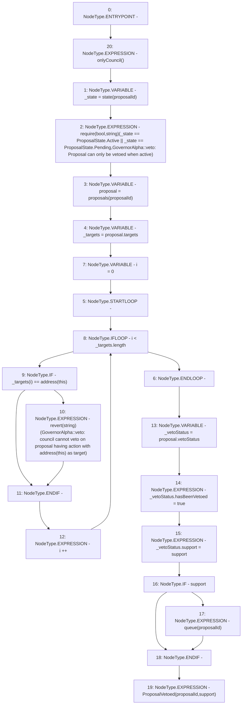

# Context: GovernorAlpha.veto

**Contract:** `GovernorAlpha` (Inherits: None)
**Signature:** `veto(uint256,bool)`
**Method Selector ID:** `0x5e8b7244`
**Visibility:** `external`
**Environment-Free:** `No (reads EVM state context)`
**Modifiers:**
- `onlyCouncil`
  ```solidity
  modifier onlyCouncil() {
          _onlyCouncil();
          _;
      }
  ```

### State Variables Interaction
- **Reads:** proposals
- **Writes:** None

### Assertion Checks & Business Requirements
- require/assert: `require(bool,string)(_state == ProposalState.Active || _state == ProposalState.Pending,GovernorAlpha::veto: Proposal can only be vetoed when active)`
- revert: `revert(string)(GovernorAlpha::veto: council cannot veto on proposal having action with address(this) as target)`

### Environment & Verification Flags
- **Uses Foundry Cheatcodes:** No
- **Has Echidna Properties:** No

### Internal Calls Tree
- None

### External Calls / Value Transfers
- None

### Control Flow Graph (CFG)


### Source Mapping
Declared in: `certora-ac-datasets/detasets/web3bugs/dataset/web3bugs/52/contracts/governance/GovernorAlpha.sol` on lines **562** to **588**

```solidity
    function veto(uint256 proposalId, bool support) external onlyCouncil {
        ProposalState _state = state(proposalId);
        require(
            _state == ProposalState.Active || _state == ProposalState.Pending,
            "GovernorAlpha::veto: Proposal can only be vetoed when active"
        );

        Proposal storage proposal = proposals[proposalId];
        address[] memory _targets = proposal.targets;
        for (uint256 i = 0; i < _targets.length; i++) {
            if (_targets[i] == address(this)) {
                revert(
                    "GovernorAlpha::veto: council cannot veto on proposal having action with address(this) as target"
                );
            }
        }

        VetoStatus storage _vetoStatus = proposal.vetoStatus;
        _vetoStatus.hasBeenVetoed = true;
        _vetoStatus.support = support;

        if (support) {
            queue(proposalId);
        }

        emit ProposalVetoed(proposalId, support);
    }

```
