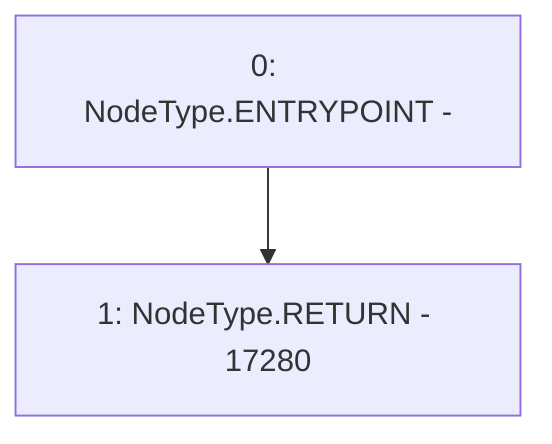

# Context: GovernorAlpha.votingPeriod

**Contract:** `GovernorAlpha` (Inherits: None)
**Signature:** `votingPeriod() returns (uint256)`
**Method Selector ID:** `0x02a251a3`
**Visibility:** `public`
**Environment-Free:** `Yes`
**Modifiers:** None

### State Variables Interaction
- **Reads:** None
- **Writes:** None

### Environment & Verification Flags
- **Uses Foundry Cheatcodes:** No
- **Has Echidna Properties:** No

### Internal Calls Tree
- None

### External Calls / Value Transfers
- None

### Control Flow Graph (CFG)


### Source Mapping
Declared in: `certora-ac-datasets/detasets/web3bugs/dataset/web3bugs/52/contracts/governance/GovernorAlpha.sol` on lines **240** to **242**

```solidity
    function votingPeriod() public pure virtual returns (uint256) {
        return 17280; // ~3 days in blocks (assuming 15s blocks)
    }

```
