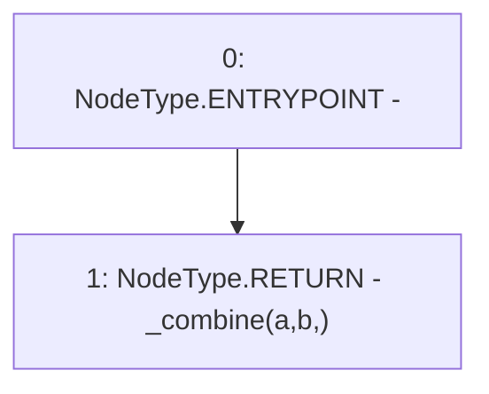

# Context: LPToken._combine

**Contract:** `LPToken` (Inherits: Ownable, ERC20, IERC20Metadata, IERC20, Context, ProtocolConstants, ILPToken)
**Signature:** `_combine(string,string) returns (string)`
**Method Selector ID:** `Internal (No Method ID)`
**Visibility:** `internal`
**Environment-Free:** `Yes`
**Modifiers:** None

### State Variables Interaction
- **Reads:** None
- **Writes:** None

### Environment & Verification Flags
- **Uses Foundry Cheatcodes:** No
- **Has Echidna Properties:** No

### Internal Calls Tree
- None

### External Calls / Value Transfers
- None

### Control Flow Graph (CFG)


### Source Mapping
Declared in: `certora-ac-datasets/detasets/web3bugs/dataset/web3bugs/52/contracts/dex-v2/wrapper/LPToken.sol` on lines **54** to **60**

```solidity
    function _combine(string memory a, string memory b)
        internal
        pure
        returns (string memory)
    {
        return _combine(a, b, "");
    }

```
