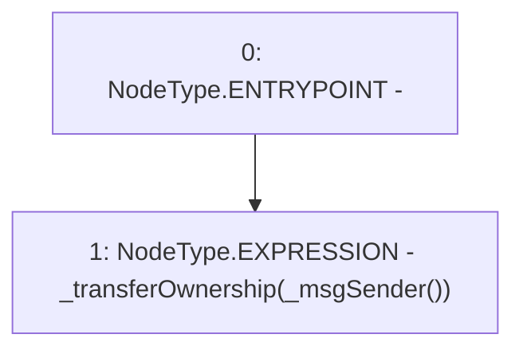

# Context: LPToken.constructor

**Contract:** `LPToken` (Inherits: Ownable, ERC20, IERC20Metadata, IERC20, Context, ProtocolConstants, ILPToken)
**Signature:** `constructor()`
**Method Selector ID:** `Internal (No Method ID)`
**Visibility:** `internal`
**Environment-Free:** `No (reads EVM state context)`
**Modifiers:** None

### State Variables Interaction
- **Reads:** None
- **Writes:** None

### Environment & Verification Flags
- **Uses Foundry Cheatcodes:** No
- **Has Echidna Properties:** No

### Internal Calls Tree
- None

### External Calls / Value Transfers
- None

### Control Flow Graph (CFG)


### Source Mapping
Declared in: `certora-ac-datasets/detasets/web3bugs/dataset/web3bugs/52/node_modules/@openzeppelin/contracts/access/Ownable.sol` on lines **28** to **30**

```solidity
    constructor() {
        _transferOwnership(_msgSender());
    }

```
