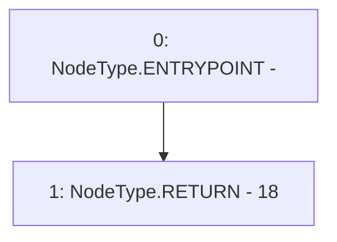

# Context: LPToken.decimals

**Contract:** `LPToken` (Inherits: Ownable, ERC20, IERC20Metadata, IERC20, Context, ProtocolConstants, ILPToken)
**Signature:** `decimals() returns (uint8)`
**Method Selector ID:** `0x313ce567`
**Visibility:** `public`
**Environment-Free:** `Yes`
**Modifiers:** None

### State Variables Interaction
- **Reads:** None
- **Writes:** None

### Environment & Verification Flags
- **Uses Foundry Cheatcodes:** No
- **Has Echidna Properties:** No

### Internal Calls Tree
- None

### External Calls / Value Transfers
- None

### Control Flow Graph (CFG)


### Source Mapping
Declared in: `certora-ac-datasets/detasets/web3bugs/dataset/web3bugs/52/node_modules/@openzeppelin/contracts/token/ERC20/ERC20.sol` on lines **87** to **89**

```solidity
    function decimals() public view virtual override returns (uint8) {
        return 18;
    }

```
