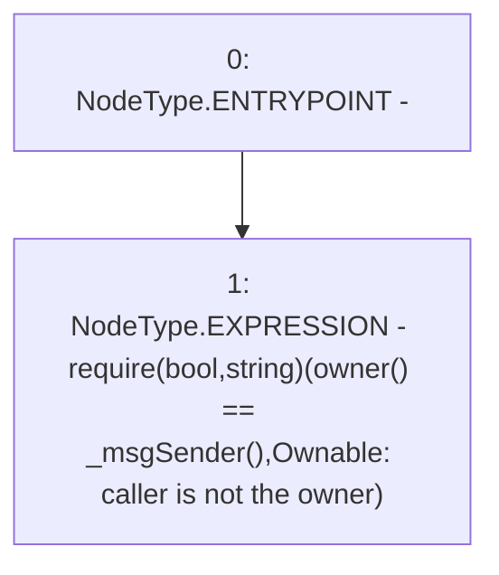

# Context: LPWrapper._checkOwner

**Contract:** `LPWrapper` (Inherits: Ownable, Context, ProtocolConstants, ILPWrapper)
**Signature:** `_checkOwner()`
**Method Selector ID:** `Internal (No Method ID)`
**Visibility:** `internal`
**Environment-Free:** `No (reads EVM state context)`
**Modifiers:** None

### State Variables Interaction
- **Reads:** None
- **Writes:** None

### Assertion Checks & Business Requirements
- require/assert: `require(bool,string)(owner() == _msgSender(),Ownable: caller is not the owner)`

### Environment & Verification Flags
- **Uses Foundry Cheatcodes:** No
- **Has Echidna Properties:** No

### Internal Calls Tree
- None

### External Calls / Value Transfers
- None

### Control Flow Graph (CFG)


### Source Mapping
Declared in: `certora-ac-datasets/detasets/web3bugs/dataset/web3bugs/52/node_modules/@openzeppelin/contracts/access/Ownable.sol` on lines **50** to **52**

```solidity
    function _checkOwner() internal view virtual {
        require(owner() == _msgSender(), "Ownable: caller is not the owner");
    }

```
