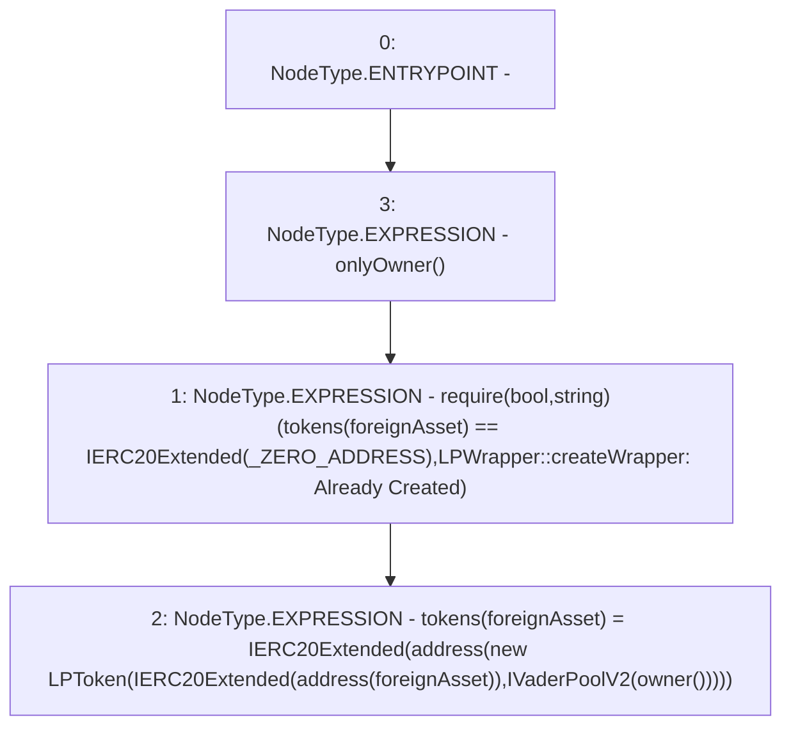

# Context: LPWrapper.createWrapper

**Contract:** `LPWrapper` (Inherits: Ownable, Context, ProtocolConstants, ILPWrapper)
**Signature:** `createWrapper(IERC20)`
**Method Selector ID:** `0xa7c4f0ef`
**Visibility:** `external`
**Environment-Free:** `No (reads EVM state context)`
**Modifiers:**
- `onlyOwner`
  ```solidity
  modifier onlyOwner() {
          _checkOwner();
          _;
      }
  ```

### State Variables Interaction
- **Reads:** _ZERO_ADDRESS, tokens
- **Writes:** tokens

### Assertion Checks & Business Requirements
- require/assert: `require(bool,string)(tokens[foreignAsset] == IERC20Extended(_ZERO_ADDRESS),LPWrapper::createWrapper: Already Created)`

### Environment & Verification Flags
- **Uses Foundry Cheatcodes:** No
- **Has Echidna Properties:** No

### Internal Calls Tree
- None

### External Calls / Value Transfers
- None

### Control Flow Graph (CFG)


### Source Mapping
Declared in: `certora-ac-datasets/detasets/web3bugs/dataset/web3bugs/52/contracts/dex-v2/wrapper/LPWrapper.sol` on lines **20** to **35**

```solidity
    function createWrapper(IERC20 foreignAsset) external override onlyOwner {
        require(
            tokens[foreignAsset] == IERC20Extended(_ZERO_ADDRESS),
            "LPWrapper::createWrapper: Already Created"
        );

        // NOTE: Here, `owner` is the VaderPoolV2
        tokens[foreignAsset] = IERC20Extended(
            address(
                new LPToken(
                    IERC20Extended(address(foreignAsset)),
                    IVaderPoolV2(owner())
                )
            )
        );
    }

```
