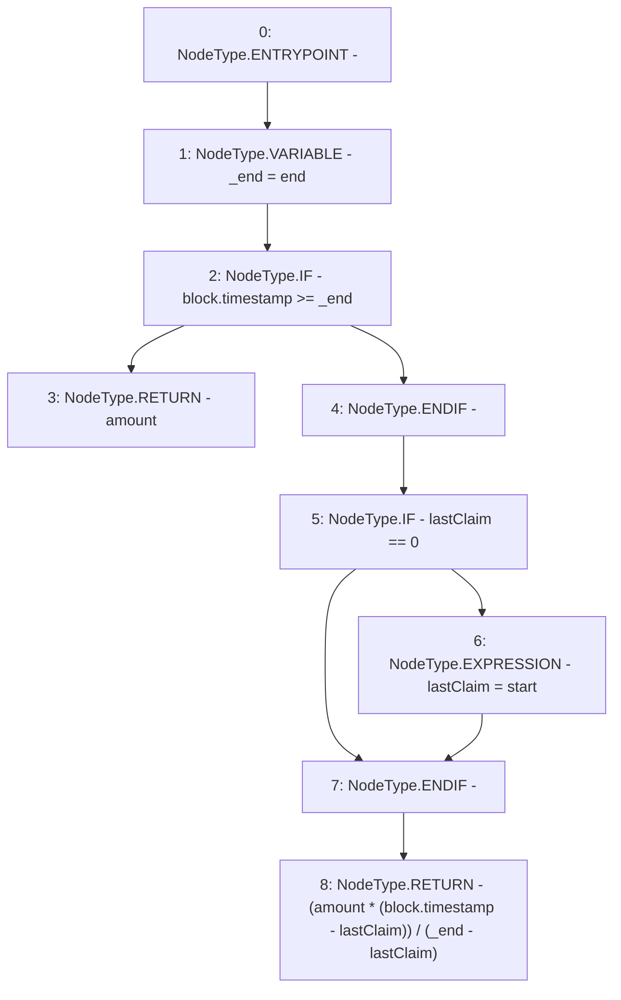

# Context: LinearVesting._getClaim

**Contract:** `LinearVesting` (Inherits: Ownable, Context, ProtocolConstants, ILinearVesting)
**Signature:** `_getClaim(uint256,uint256) returns (uint256)`
**Method Selector ID:** `Internal (No Method ID)`
**Visibility:** `private`
**Environment-Free:** `No (reads EVM state context)`
**Modifiers:** None

### State Variables Interaction
- **Reads:** end, start
- **Writes:** None

### Environment & Verification Flags
- **Uses Foundry Cheatcodes:** No
- **Has Echidna Properties:** No

### Internal Calls Tree
- None

### External Calls / Value Transfers
- None

### Control Flow Graph (CFG)


### Source Mapping
Declared in: `certora-ac-datasets/detasets/web3bugs/dataset/web3bugs/52/contracts/tokens/vesting/LinearVesting.sol` on lines **251** to **262**

```solidity
    function _getClaim(uint256 amount, uint256 lastClaim)
        private
        view
        returns (uint256)
    {
        uint256 _end = end;

        if (block.timestamp >= _end) return amount;
        if (lastClaim == 0) lastClaim = start;

        return (amount * (block.timestamp - lastClaim)) / (_end - lastClaim);
    }

```
