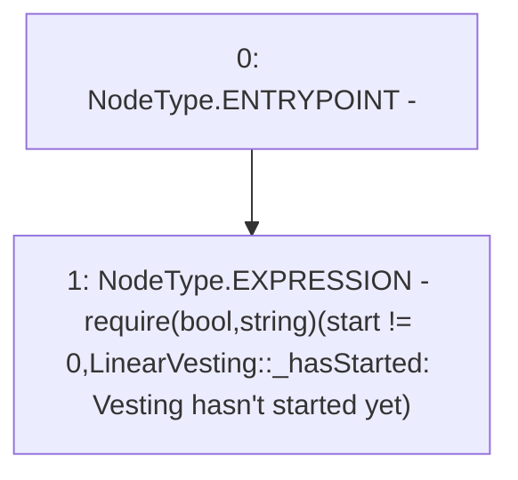

# Context: LinearVesting._hasStarted

**Contract:** `LinearVesting` (Inherits: Ownable, Context, ProtocolConstants, ILinearVesting)
**Signature:** `_hasStarted()`
**Method Selector ID:** `Internal (No Method ID)`
**Visibility:** `private`
**Environment-Free:** `Yes`
**Modifiers:** None

### State Variables Interaction
- **Reads:** start
- **Writes:** None

### Assertion Checks & Business Requirements
- require/assert: `require(bool,string)(start != 0,LinearVesting::_hasStarted: Vesting hasn't started yet)`

### Environment & Verification Flags
- **Uses Foundry Cheatcodes:** No
- **Has Echidna Properties:** No

### Internal Calls Tree
- None

### External Calls / Value Transfers
- None

### Control Flow Graph (CFG)


### Source Mapping
Declared in: `certora-ac-datasets/detasets/web3bugs/dataset/web3bugs/52/contracts/tokens/vesting/LinearVesting.sol` on lines **300** to **305**

```solidity
    function _hasStarted() private view {
        require(
            start != 0,
            "LinearVesting::_hasStarted: Vesting hasn't started yet"
        );
    }

```
