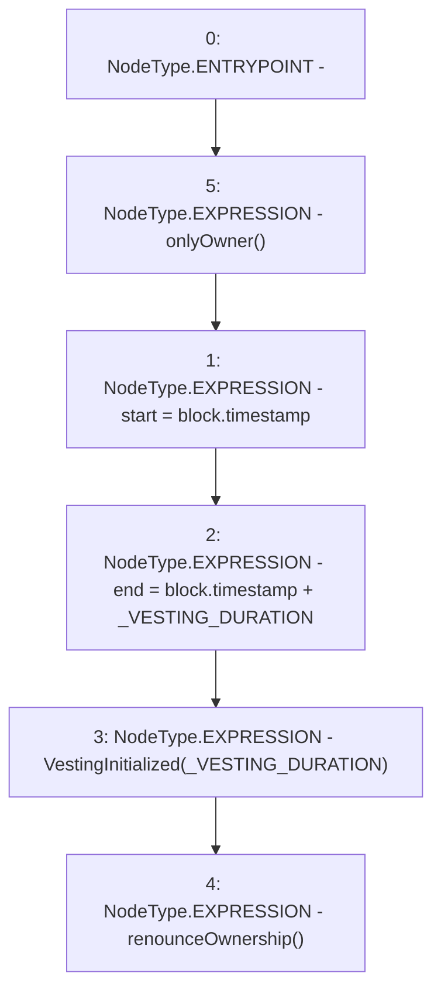

# Context: LinearVesting.begin

**Contract:** `LinearVesting` (Inherits: Ownable, Context, ProtocolConstants, ILinearVesting)
**Signature:** `begin()`
**Method Selector ID:** `0x1bce6ff3`
**Visibility:** `external`
**Environment-Free:** `No (reads EVM state context)`
**Modifiers:**
- `onlyOwner`
  ```solidity
  modifier onlyOwner() {
          _checkOwner();
          _;
      }
  ```

### State Variables Interaction
- **Reads:** _VESTING_DURATION
- **Writes:** end, start

### Environment & Verification Flags
- **Uses Foundry Cheatcodes:** No
- **Has Echidna Properties:** No

### Internal Calls Tree
- None

### External Calls / Value Transfers
- None

### Control Flow Graph (CFG)


### Source Mapping
Declared in: `certora-ac-datasets/detasets/web3bugs/dataset/web3bugs/52/contracts/tokens/vesting/LinearVesting.sol` on lines **202** to **209**

```solidity
    function begin() external override onlyOwner {
        start = block.timestamp;
        end = block.timestamp + _VESTING_DURATION;

        emit VestingInitialized(_VESTING_DURATION);

        renounceOwnership();
    }

```
