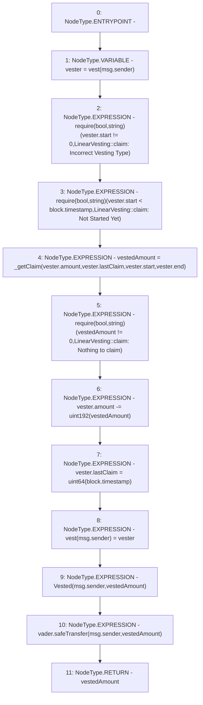

# Context: LinearVesting.claimConverted

**Contract:** `LinearVesting` (Inherits: Ownable, Context, ProtocolConstants, ILinearVesting)
**Signature:** `claimConverted() returns (uint256)`
**Method Selector ID:** `0x01e8ef2a`
**Visibility:** `external`
**Environment-Free:** `No (reads EVM state context)`
**Modifiers:** None

### State Variables Interaction
- **Reads:** vader, vest
- **Writes:** vest

### Assertion Checks & Business Requirements
- require/assert: `require(bool,string)(vester.start != 0,LinearVesting::claim: Incorrect Vesting Type)`
- require/assert: `require(bool,string)(vester.start < block.timestamp,LinearVesting::claim: Not Started Yet)`
- require/assert: `require(bool,string)(vestedAmount != 0,LinearVesting::claim: Nothing to claim)`

### Environment & Verification Flags
- **Uses Foundry Cheatcodes:** No
- **Has Echidna Properties:** No

### Internal Calls Tree
- None

### External Calls / Value Transfers
- `SafeERC20.LIBRARY_CALL, dest:SafeERC20, function:SafeERC20.safeTransfer(IERC20,address,uint256), arguments:['vader', 'msg.sender', 'vestedAmount'] `

### Control Flow Graph (CFG)


### Source Mapping
Declared in: `certora-ac-datasets/detasets/web3bugs/dataset/web3bugs/52/contracts/tokens/vesting/LinearVesting.sol` on lines **158** to **188**

```solidity
    function claimConverted() external override returns (uint256 vestedAmount) {
        Vester memory vester = vest[msg.sender];

        require(
            vester.start != 0,
            "LinearVesting::claim: Incorrect Vesting Type"
        );

        require(
            vester.start < block.timestamp,
            "LinearVesting::claim: Not Started Yet"
        );

        vestedAmount = _getClaim(
            vester.amount,
            vester.lastClaim,
            vester.start,
            vester.end
        );

        require(vestedAmount != 0, "LinearVesting::claim: Nothing to claim");

        vester.amount -= uint192(vestedAmount);
        vester.lastClaim = uint64(block.timestamp);

        vest[msg.sender] = vester;

        emit Vested(msg.sender, vestedAmount);

        vader.safeTransfer(msg.sender, vestedAmount);
    }

```
