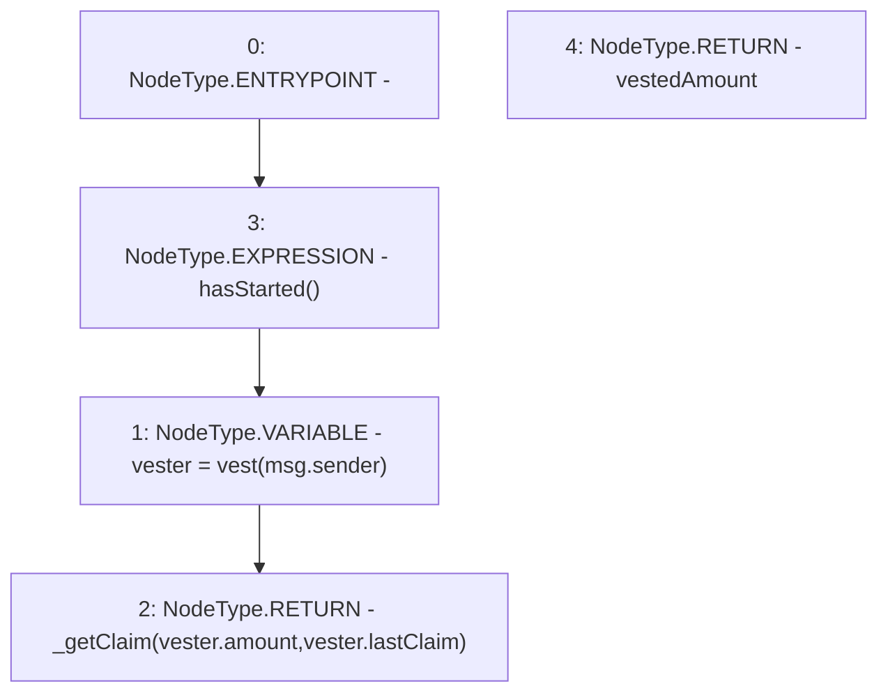

# Context: LinearVesting.getClaim

**Contract:** `LinearVesting` (Inherits: Ownable, Context, ProtocolConstants, ILinearVesting)
**Signature:** `getClaim() returns (uint256)`
**Method Selector ID:** `0x844a8c69`
**Visibility:** `external`
**Environment-Free:** `No (reads EVM state context)`
**Modifiers:**
- `hasStarted`
  ```solidity
  modifier hasStarted() {
          _hasStarted();
          _;
      }
  ```

### State Variables Interaction
- **Reads:** vest
- **Writes:** None

### Environment & Verification Flags
- **Uses Foundry Cheatcodes:** No
- **Has Echidna Properties:** No

### Internal Calls Tree
- None

### External Calls / Value Transfers
- None

### Control Flow Graph (CFG)


### Source Mapping
Declared in: `certora-ac-datasets/detasets/web3bugs/dataset/web3bugs/52/contracts/tokens/vesting/LinearVesting.sol` on lines **96** to **105**

```solidity
    function getClaim()
        external
        view
        override
        hasStarted
        returns (uint256 vestedAmount)
    {
        Vester memory vester = vest[msg.sender];
        return _getClaim(vester.amount, vester.lastClaim);
    }

```
