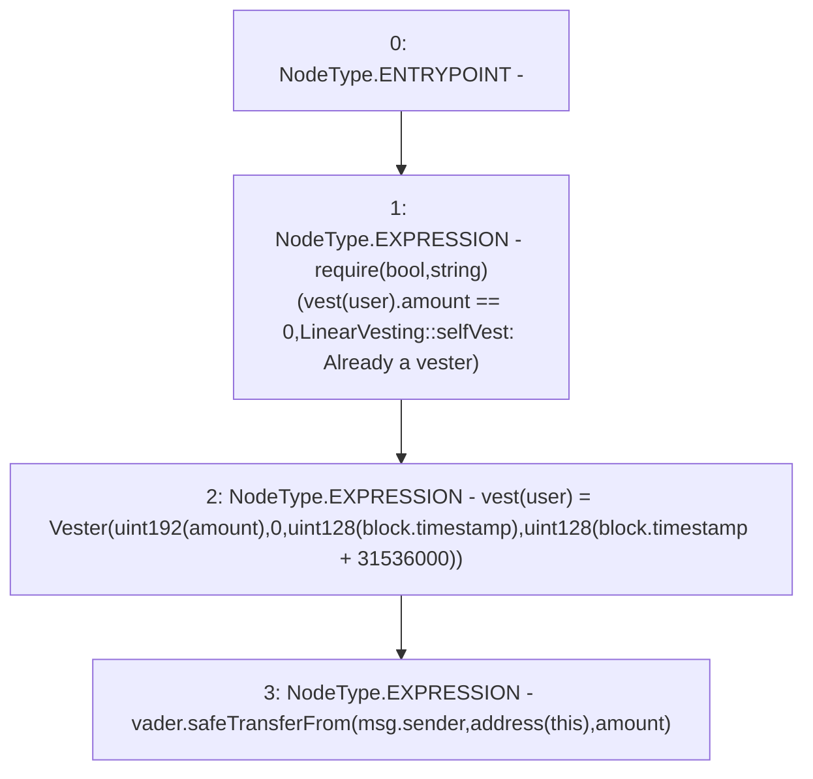

# Context: LinearVesting.vestFor

**Contract:** `LinearVesting` (Inherits: Ownable, Context, ProtocolConstants, ILinearVesting)
**Signature:** `vestFor(address,uint256)`
**Method Selector ID:** `0x94e35169`
**Visibility:** `external`
**Environment-Free:** `No (reads EVM state context)`
**Modifiers:** None

### State Variables Interaction
- **Reads:** vader, vest
- **Writes:** vest

### Assertion Checks & Business Requirements
- require/assert: `require(bool,string)(vest[user].amount == 0,LinearVesting::selfVest: Already a vester)`

### Environment & Verification Flags
- **Uses Foundry Cheatcodes:** No
- **Has Echidna Properties:** No

### Internal Calls Tree
- None

### External Calls / Value Transfers
- `SafeERC20.LIBRARY_CALL, dest:SafeERC20, function:SafeERC20.safeTransferFrom(IERC20,address,address,uint256), arguments:['vader', 'msg.sender', 'TMP_164', 'amount'] `

### Control Flow Graph (CFG)


### Source Mapping
Declared in: `certora-ac-datasets/detasets/web3bugs/dataset/web3bugs/52/contracts/tokens/vesting/LinearVesting.sol` on lines **214** to **226**

```solidity
    function vestFor(address user, uint256 amount) external override {
        require(
            vest[user].amount == 0,
            "LinearVesting::selfVest: Already a vester"
        );
        vest[user] = Vester(
            uint192(amount),
            0,
            uint128(block.timestamp),
            uint128(block.timestamp + 365 days)
        );
        vader.safeTransferFrom(msg.sender, address(this), amount);
    }

```
