# Context: Math.log10

**Contract:** `Math` (Inherits: None)
**Signature:** `log10(uint256) returns (uint256)`
**Method Selector ID:** `Internal (No Method ID)`
**Visibility:** `internal`
**Environment-Free:** `Yes`
**Modifiers:** None

### State Variables Interaction
- **Reads:** None
- **Writes:** None

### Environment & Verification Flags
- **Uses Foundry Cheatcodes:** No
- **Has Echidna Properties:** No

### Internal Calls Tree
- None

### External Calls / Value Transfers
- None

### Control Flow Graph (CFG)

```mermaid
flowchart TD
    Node_0["0: NodeType.ENTRYPOINT - "]
    Node_0 --> Node_1
    Node_1["1: NodeType.VARIABLE - result = 0"]
    Node_1 --> Node_2
    Node_2["2: NodeType.IF - value >= 10 ** 64"]
    Node_2 --> Node_3
    Node_2 --> Node_5
    Node_3["3: NodeType.EXPRESSION - value /= 10 ** 64"]
    Node_3 --> Node_4
    Node_4["4: NodeType.EXPRESSION - result += 64"]
    Node_4 --> Node_5
    Node_5["5: NodeType.ENDIF - "]
    Node_5 --> Node_6
    Node_6["6: NodeType.IF - value >= 10 ** 32"]
    Node_6 --> Node_7
    Node_6 --> Node_9
    Node_7["7: NodeType.EXPRESSION - value /= 10 ** 32"]
    Node_7 --> Node_8
    Node_8["8: NodeType.EXPRESSION - result += 32"]
    Node_8 --> Node_9
    Node_9["9: NodeType.ENDIF - "]
    Node_9 --> Node_10
    Node_10["10: NodeType.IF - value >= 10 ** 16"]
    Node_10 --> Node_11
    Node_10 --> Node_13
    Node_11["11: NodeType.EXPRESSION - value /= 10 ** 16"]
    Node_11 --> Node_12
    Node_12["12: NodeType.EXPRESSION - result += 16"]
    Node_12 --> Node_13
    Node_13["13: NodeType.ENDIF - "]
    Node_13 --> Node_14
    Node_14["14: NodeType.IF - value >= 10 ** 8"]
    Node_14 --> Node_15
    Node_14 --> Node_17
    Node_15["15: NodeType.EXPRESSION - value /= 10 ** 8"]
    Node_15 --> Node_16
    Node_16["16: NodeType.EXPRESSION - result += 8"]
    Node_16 --> Node_17
    Node_17["17: NodeType.ENDIF - "]
    Node_17 --> Node_18
    Node_18["18: NodeType.IF - value >= 10 ** 4"]
    Node_18 --> Node_19
    Node_18 --> Node_21
    Node_19["19: NodeType.EXPRESSION - value /= 10 ** 4"]
    Node_19 --> Node_20
    Node_20["20: NodeType.EXPRESSION - result += 4"]
    Node_20 --> Node_21
    Node_21["21: NodeType.ENDIF - "]
    Node_21 --> Node_22
    Node_22["22: NodeType.IF - value >= 10 ** 2"]
    Node_22 --> Node_23
    Node_22 --> Node_25
    Node_23["23: NodeType.EXPRESSION - value /= 10 ** 2"]
    Node_23 --> Node_24
    Node_24["24: NodeType.EXPRESSION - result += 2"]
    Node_24 --> Node_25
    Node_25["25: NodeType.ENDIF - "]
    Node_25 --> Node_26
    Node_26["26: NodeType.IF - value >= 10 ** 1"]
    Node_26 --> Node_27
    Node_26 --> Node_28
    Node_27["27: NodeType.EXPRESSION - result += 1"]
    Node_27 --> Node_28
    Node_28["28: NodeType.ENDIF - "]
    Node_28 --> Node_29
    Node_29["29: NodeType.RETURN - result"]
```


### Source Mapping
Declared in: `certora-ac-datasets/detasets/web3bugs/dataset/web3bugs/52/node_modules/@openzeppelin/contracts/utils/math/Math.sol` on lines **252** to **284**

```solidity
    function log10(uint256 value) internal pure returns (uint256) {
        uint256 result = 0;
        unchecked {
            if (value >= 10 ** 64) {
                value /= 10 ** 64;
                result += 64;
            }
            if (value >= 10 ** 32) {
                value /= 10 ** 32;
                result += 32;
            }
            if (value >= 10 ** 16) {
                value /= 10 ** 16;
                result += 16;
            }
            if (value >= 10 ** 8) {
                value /= 10 ** 8;
                result += 8;
            }
            if (value >= 10 ** 4) {
                value /= 10 ** 4;
                result += 4;
            }
            if (value >= 10 ** 2) {
                value /= 10 ** 2;
                result += 2;
            }
            if (value >= 10 ** 1) {
                result += 1;
            }
        }
        return result;
    }

```
