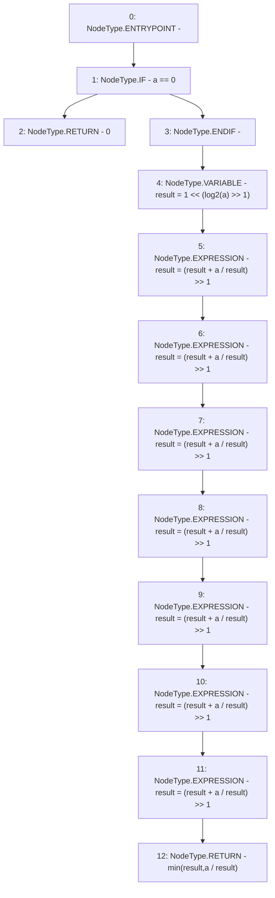

# Context: Math.sqrt

**Contract:** `Math` (Inherits: None)
**Signature:** `sqrt(uint256) returns (uint256)`
**Method Selector ID:** `Internal (No Method ID)`
**Visibility:** `internal`
**Environment-Free:** `Yes`
**Modifiers:** None

### State Variables Interaction
- **Reads:** None
- **Writes:** None

### Environment & Verification Flags
- **Uses Foundry Cheatcodes:** No
- **Has Echidna Properties:** No

### Internal Calls Tree
- None

### External Calls / Value Transfers
- None

### Control Flow Graph (CFG)


### Source Mapping
Declared in: `certora-ac-datasets/detasets/web3bugs/dataset/web3bugs/52/node_modules/@openzeppelin/contracts/utils/math/Math.sol` on lines **152** to **183**

```solidity
    function sqrt(uint256 a) internal pure returns (uint256) {
        if (a == 0) {
            return 0;
        }

        // For our first guess, we get the biggest power of 2 which is smaller than the square root of the target.
        //
        // We know that the "msb" (most significant bit) of our target number `a` is a power of 2 such that we have
        // `msb(a) <= a < 2*msb(a)`. This value can be written `msb(a)=2**k` with `k=log2(a)`.
        //
        // This can be rewritten `2**log2(a) <= a < 2**(log2(a) + 1)`
        // → `sqrt(2**k) <= sqrt(a) < sqrt(2**(k+1))`
        // → `2**(k/2) <= sqrt(a) < 2**((k+1)/2) <= 2**(k/2 + 1)`
        //
        // Consequently, `2**(log2(a) / 2)` is a good first approximation of `sqrt(a)` with at least 1 correct bit.
        uint256 result = 1 << (log2(a) >> 1);

        // At this point `result` is an estimation with one bit of precision. We know the true value is a uint128,
        // since it is the square root of a uint256. Newton's method converges quadratically (precision doubles at
        // every iteration). We thus need at most 7 iteration to turn our partial result with one bit of precision
        // into the expected uint128 result.
        unchecked {
            result = (result + a / result) >> 1;
            result = (result + a / result) >> 1;
            result = (result + a / result) >> 1;
            result = (result + a / result) >> 1;
            result = (result + a / result) >> 1;
            result = (result + a / result) >> 1;
            result = (result + a / result) >> 1;
            return min(result, a / result);
        }
    }

```
