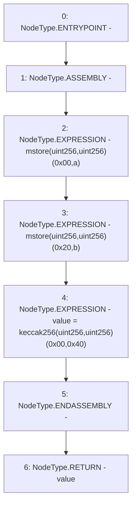

# Context: MerkleProof._efficientHash

**Contract:** `MerkleProof` (Inherits: None)
**Signature:** `_efficientHash(bytes32,bytes32) returns (bytes32)`
**Method Selector ID:** `Internal (No Method ID)`
**Visibility:** `private`
**Environment-Free:** `Yes`
**Modifiers:** None

### State Variables Interaction
- **Reads:** None
- **Writes:** None

### Environment & Verification Flags
- **Uses Foundry Cheatcodes:** No
- **Has Echidna Properties:** No

### Internal Calls Tree
- None

### External Calls / Value Transfers
- None

### Control Flow Graph (CFG)


### Source Mapping
Declared in: `certora-ac-datasets/detasets/web3bugs/dataset/web3bugs/52/node_modules/@openzeppelin/contracts/utils/cryptography/MerkleProof.sol` on lines **219** to **226**

```solidity
    function _efficientHash(bytes32 a, bytes32 b) private pure returns (bytes32 value) {
        /// @solidity memory-safe-assembly
        assembly {
            mstore(0x00, a)
            mstore(0x20, b)
            value := keccak256(0x00, 0x40)
        }
    }

```
