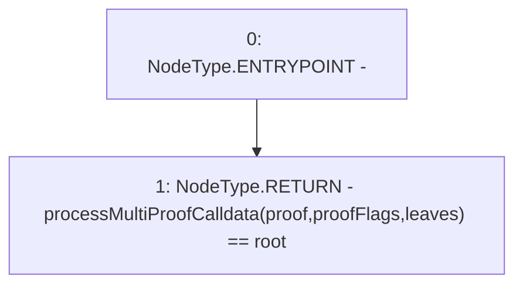

# Context: MerkleProof.multiProofVerifyCalldata

**Contract:** `MerkleProof` (Inherits: None)
**Signature:** `multiProofVerifyCalldata(bytes32[],bool[],bytes32,bytes32[]) returns (bool)`
**Method Selector ID:** `Internal (No Method ID)`
**Visibility:** `internal`
**Environment-Free:** `Yes`
**Modifiers:** None

### State Variables Interaction
- **Reads:** None
- **Writes:** None

### Environment & Verification Flags
- **Uses Foundry Cheatcodes:** No
- **Has Echidna Properties:** No

### Internal Calls Tree
- None

### External Calls / Value Transfers
- None

### Control Flow Graph (CFG)


### Source Mapping
Declared in: `certora-ac-datasets/detasets/web3bugs/dataset/web3bugs/52/node_modules/@openzeppelin/contracts/utils/cryptography/MerkleProof.sol` on lines **93** to **100**

```solidity
    function multiProofVerifyCalldata(
        bytes32[] calldata proof,
        bool[] calldata proofFlags,
        bytes32 root,
        bytes32[] memory leaves
    ) internal pure returns (bool) {
        return processMultiProofCalldata(proof, proofFlags, leaves) == root;
    }

```
