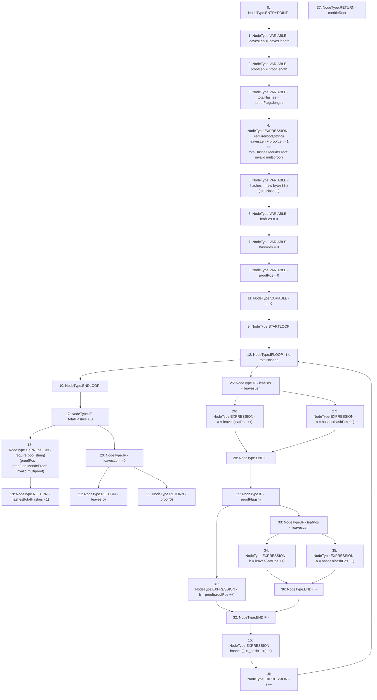

# Context: MerkleProof.processMultiProofCalldata

**Contract:** `MerkleProof` (Inherits: None)
**Signature:** `processMultiProofCalldata(bytes32[],bool[],bytes32[]) returns (bytes32)`
**Method Selector ID:** `Internal (No Method ID)`
**Visibility:** `internal`
**Environment-Free:** `Yes`
**Modifiers:** None

### State Variables Interaction
- **Reads:** None
- **Writes:** None

### Assertion Checks & Business Requirements
- require/assert: `require(bool,string)(leavesLen + proofLen - 1 == totalHashes,MerkleProof: invalid multiproof)`
- require/assert: `require(bool,string)(proofPos == proofLen,MerkleProof: invalid multiproof)`

### Environment & Verification Flags
- **Uses Foundry Cheatcodes:** No
- **Has Echidna Properties:** No

### Internal Calls Tree
- None

### External Calls / Value Transfers
- None

### Control Flow Graph (CFG)


### Source Mapping
Declared in: `certora-ac-datasets/detasets/web3bugs/dataset/web3bugs/52/node_modules/@openzeppelin/contracts/utils/cryptography/MerkleProof.sol` on lines **168** to **213**

```solidity
    function processMultiProofCalldata(
        bytes32[] calldata proof,
        bool[] calldata proofFlags,
        bytes32[] memory leaves
    ) internal pure returns (bytes32 merkleRoot) {
        // This function rebuilds the root hash by traversing the tree up from the leaves. The root is rebuilt by
        // consuming and producing values on a queue. The queue starts with the `leaves` array, then goes onto the
        // `hashes` array. At the end of the process, the last hash in the `hashes` array should contain the root of
        // the merkle tree.
        uint256 leavesLen = leaves.length;
        uint256 proofLen = proof.length;
        uint256 totalHashes = proofFlags.length;

        // Check proof validity.
        require(leavesLen + proofLen - 1 == totalHashes, "MerkleProof: invalid multiproof");

        // The xxxPos values are "pointers" to the next value to consume in each array. All accesses are done using
        // `xxx[xxxPos++]`, which return the current value and increment the pointer, thus mimicking a queue's "pop".
        bytes32[] memory hashes = new bytes32[](totalHashes);
        uint256 leafPos = 0;
        uint256 hashPos = 0;
        uint256 proofPos = 0;
        // At each step, we compute the next hash using two values:
        // - a value from the "main queue". If not all leaves have been consumed, we get the next leaf, otherwise we
        //   get the next hash.
        // - depending on the flag, either another value from the "main queue" (merging branches) or an element from the
        //   `proof` array.
        for (uint256 i = 0; i < totalHashes; i++) {
            bytes32 a = leafPos < leavesLen ? leaves[leafPos++] : hashes[hashPos++];
            bytes32 b = proofFlags[i]
                ? (leafPos < leavesLen ? leaves[leafPos++] : hashes[hashPos++])
                : proof[proofPos++];
            hashes[i] = _hashPair(a, b);
        }

        if (totalHashes > 0) {
            require(proofPos == proofLen, "MerkleProof: invalid multiproof");
            unchecked {
                return hashes[totalHashes - 1];
            }
        } else if (leavesLen > 0) {
            return leaves[0];
        } else {
            return proof[0];
        }
    }

```
