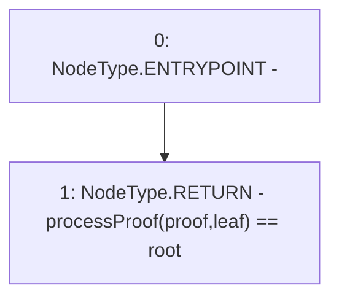

# Context: MerkleProof.verify

**Contract:** `MerkleProof` (Inherits: None)
**Signature:** `verify(bytes32[],bytes32,bytes32) returns (bool)`
**Method Selector ID:** `Internal (No Method ID)`
**Visibility:** `internal`
**Environment-Free:** `Yes`
**Modifiers:** None

### State Variables Interaction
- **Reads:** None
- **Writes:** None

### Environment & Verification Flags
- **Uses Foundry Cheatcodes:** No
- **Has Echidna Properties:** No

### Internal Calls Tree
- None

### External Calls / Value Transfers
- None

### Control Flow Graph (CFG)


### Source Mapping
Declared in: `certora-ac-datasets/detasets/web3bugs/dataset/web3bugs/52/node_modules/@openzeppelin/contracts/utils/cryptography/MerkleProof.sol` on lines **27** to **29**

```solidity
    function verify(bytes32[] memory proof, bytes32 root, bytes32 leaf) internal pure returns (bool) {
        return processProof(proof, leaf) == root;
    }

```
