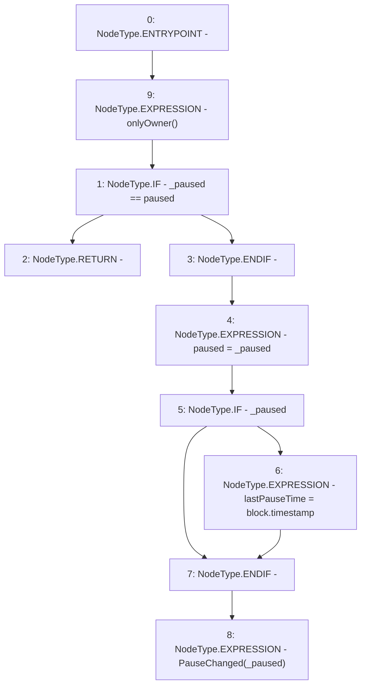

# Context: Pausable.setPaused

**Contract:** `Pausable` (Inherits: Owned)
**Signature:** `setPaused(bool)`
**Method Selector ID:** `0x16c38b3c`
**Visibility:** `external`
**Environment-Free:** `No (reads EVM state context)`
**Modifiers:**
- `onlyOwner`
  ```solidity
  modifier onlyOwner {
          _onlyOwner();
          _;
      }
  ```

### State Variables Interaction
- **Reads:** paused
- **Writes:** lastPauseTime, paused

### Environment & Verification Flags
- **Uses Foundry Cheatcodes:** No
- **Has Echidna Properties:** No

### Internal Calls Tree
- None

### External Calls / Value Transfers
- None

### Control Flow Graph (CFG)


### Source Mapping
Declared in: `certora-ac-datasets/detasets/web3bugs/dataset/web3bugs/52/contracts/staking-rewards/Pausable.sol` on lines **20** to **36**

```solidity
    function setPaused(bool _paused) external onlyOwner {
        // Ensure we're actually changing the state before we do anything
        if (_paused == paused) {
            return;
        }

        // Set our paused state.
        paused = _paused;

        // If applicable, set the last pause time.
        if (_paused) {
            lastPauseTime = block.timestamp;
        }

        // Let everyone know that our pause state has changed.
        emit PauseChanged(_paused);
    }

```
