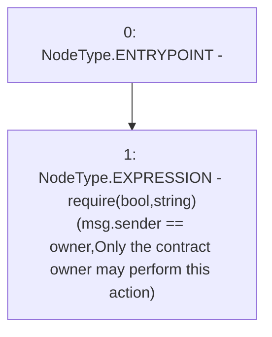

# Context: RewardsDistributionRecipient._onlyOwner

**Contract:** `RewardsDistributionRecipient` (Inherits: Owned)
**Signature:** `_onlyOwner()`
**Method Selector ID:** `Internal (No Method ID)`
**Visibility:** `private`
**Environment-Free:** `No (reads EVM state context)`
**Modifiers:** None

### State Variables Interaction
- **Reads:** owner
- **Writes:** None

### Assertion Checks & Business Requirements
- require/assert: `require(bool,string)(msg.sender == owner,Only the contract owner may perform this action)`

### Environment & Verification Flags
- **Uses Foundry Cheatcodes:** No
- **Has Echidna Properties:** No

### Internal Calls Tree
- None

### External Calls / Value Transfers
- None

### Control Flow Graph (CFG)


### Source Mapping
Declared in: `certora-ac-datasets/detasets/web3bugs/dataset/web3bugs/52/contracts/staking-rewards/Owned.sol` on lines **31** to **33**

```solidity
    function _onlyOwner() private view {
        require(msg.sender == owner, "Only the contract owner may perform this action");
    }

```
