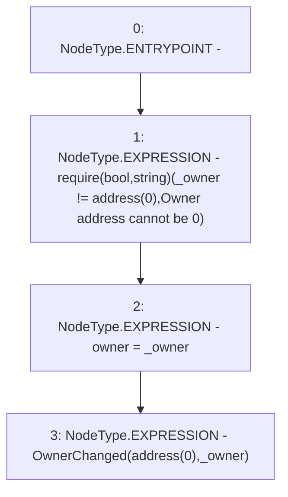

# Context: RewardsDistributionRecipient.constructor

**Contract:** `RewardsDistributionRecipient` (Inherits: Owned)
**Signature:** `constructor(address)`
**Method Selector ID:** `0xf8a6c595`
**Visibility:** `public`
**Environment-Free:** `Yes`
**Modifiers:** None

### State Variables Interaction
- **Reads:** None
- **Writes:** owner

### Assertion Checks & Business Requirements
- require/assert: `require(bool,string)(_owner != address(0),Owner address cannot be 0)`

### Environment & Verification Flags
- **Uses Foundry Cheatcodes:** No
- **Has Echidna Properties:** No

### Internal Calls Tree
- None

### External Calls / Value Transfers
- None

### Control Flow Graph (CFG)


### Source Mapping
Declared in: `certora-ac-datasets/detasets/web3bugs/dataset/web3bugs/52/contracts/staking-rewards/Owned.sol` on lines **8** to **12**

```solidity
    constructor(address _owner) {
        require(_owner != address(0), "Owner address cannot be 0");
        owner = _owner;
        emit OwnerChanged(address(0), _owner);
    }

```
