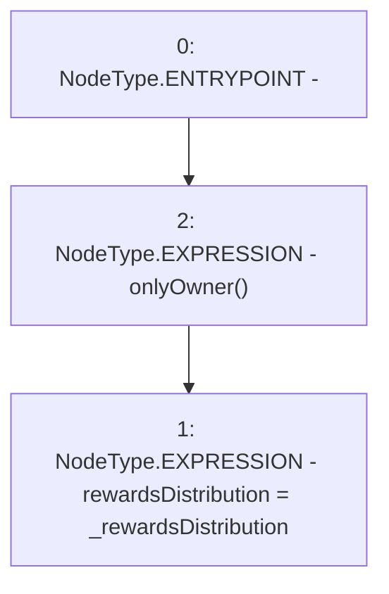

# Context: RewardsDistributionRecipient.setRewardsDistribution

**Contract:** `RewardsDistributionRecipient` (Inherits: Owned)
**Signature:** `setRewardsDistribution(address)`
**Method Selector ID:** `0x19762143`
**Visibility:** `external`
**Environment-Free:** `No (reads EVM state context)`
**Modifiers:**
- `onlyOwner`
  ```solidity
  modifier onlyOwner {
          _onlyOwner();
          _;
      }
  ```

### State Variables Interaction
- **Reads:** None
- **Writes:** rewardsDistribution

### Environment & Verification Flags
- **Uses Foundry Cheatcodes:** No
- **Has Echidna Properties:** No

### Internal Calls Tree
- None

### External Calls / Value Transfers
- None

### Control Flow Graph (CFG)


### Source Mapping
Declared in: `certora-ac-datasets/detasets/web3bugs/dataset/web3bugs/52/contracts/staking-rewards/RewardsDistributionRecipient.sol` on lines **16** to **18**

```solidity
    function setRewardsDistribution(address _rewardsDistribution) external onlyOwner {
        rewardsDistribution = _rewardsDistribution;
    }

```
