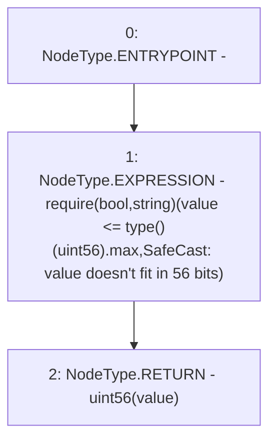

# Context: SafeCast.toUint56

**Contract:** `SafeCast` (Inherits: None)
**Signature:** `toUint56(uint256) returns (uint56)`
**Method Selector ID:** `Internal (No Method ID)`
**Visibility:** `internal`
**Environment-Free:** `Yes`
**Modifiers:** None

### State Variables Interaction
- **Reads:** None
- **Writes:** None

### Assertion Checks & Business Requirements
- require/assert: `require(bool,string)(value <= type()(uint56).max,SafeCast: value doesn't fit in 56 bits)`

### Environment & Verification Flags
- **Uses Foundry Cheatcodes:** No
- **Has Echidna Properties:** No

### Internal Calls Tree
- None

### External Calls / Value Transfers
- None

### Control Flow Graph (CFG)


### Source Mapping
Declared in: `certora-ac-datasets/detasets/web3bugs/dataset/web3bugs/52/node_modules/@openzeppelin/contracts/utils/math/SafeCast.sol` on lines **443** to **446**

```solidity
    function toUint56(uint256 value) internal pure returns (uint56) {
        require(value <= type(uint56).max, "SafeCast: value doesn't fit in 56 bits");
        return uint56(value);
    }

```
