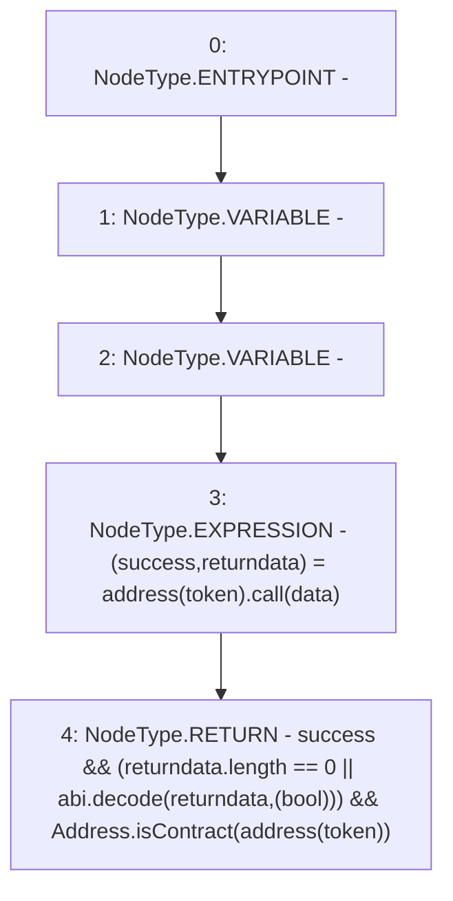

# Context: SafeERC20._callOptionalReturnBool

**Contract:** `SafeERC20` (Inherits: None)
**Signature:** `_callOptionalReturnBool(IERC20,bytes) returns (bool)`
**Method Selector ID:** `Internal (No Method ID)`
**Visibility:** `private`
**Environment-Free:** `Yes`
**Modifiers:** None

### State Variables Interaction
- **Reads:** None
- **Writes:** None

### Environment & Verification Flags
- **Uses Foundry Cheatcodes:** No
- **Has Echidna Properties:** No

### Internal Calls Tree
- None

### External Calls / Value Transfers
- `low-level-call`
- `Address.TMP_64(bool) = LIBRARY_CALL, dest:Address, function:Address.isContract(address), arguments:['TMP_63'] `

### Control Flow Graph (CFG)


### Source Mapping
Declared in: `certora-ac-datasets/detasets/web3bugs/dataset/web3bugs/52/node_modules/@openzeppelin/contracts/token/ERC20/utils/SafeERC20.sol` on lines **134** to **142**

```solidity
    function _callOptionalReturnBool(IERC20 token, bytes memory data) private returns (bool) {
        // We need to perform a low level call here, to bypass Solidity's return data size checking mechanism, since
        // we're implementing it ourselves. We cannot use {Address-functionCall} here since this should return false
        // and not revert is the subcall reverts.

        (bool success, bytes memory returndata) = address(token).call(data);
        return
            success && (returndata.length == 0 || abi.decode(returndata, (bool))) && Address.isContract(address(token));
    }

```
