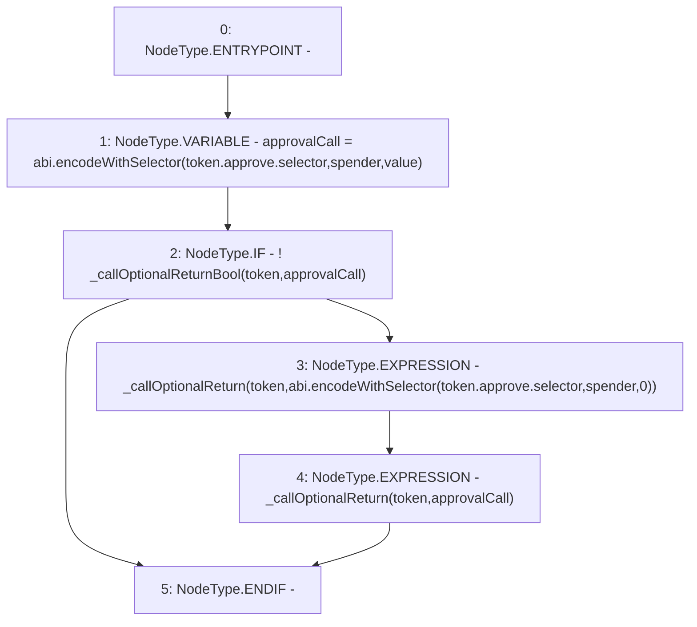

# Context: SafeERC20.forceApprove

**Contract:** `SafeERC20` (Inherits: None)
**Signature:** `forceApprove(IERC20,address,uint256)`
**Method Selector ID:** `Internal (No Method ID)`
**Visibility:** `internal`
**Environment-Free:** `Yes`
**Modifiers:** None

### State Variables Interaction
- **Reads:** None
- **Writes:** None

### Environment & Verification Flags
- **Uses Foundry Cheatcodes:** No
- **Has Echidna Properties:** No

### Internal Calls Tree
- None

### External Calls / Value Transfers
- None

### Control Flow Graph (CFG)


### Source Mapping
Declared in: `certora-ac-datasets/detasets/web3bugs/dataset/web3bugs/52/node_modules/@openzeppelin/contracts/token/ERC20/utils/SafeERC20.sol` on lines **82** to **89**

```solidity
    function forceApprove(IERC20 token, address spender, uint256 value) internal {
        bytes memory approvalCall = abi.encodeWithSelector(token.approve.selector, spender, value);

        if (!_callOptionalReturnBool(token, approvalCall)) {
            _callOptionalReturn(token, abi.encodeWithSelector(token.approve.selector, spender, 0));
            _callOptionalReturn(token, approvalCall);
        }
    }

```
