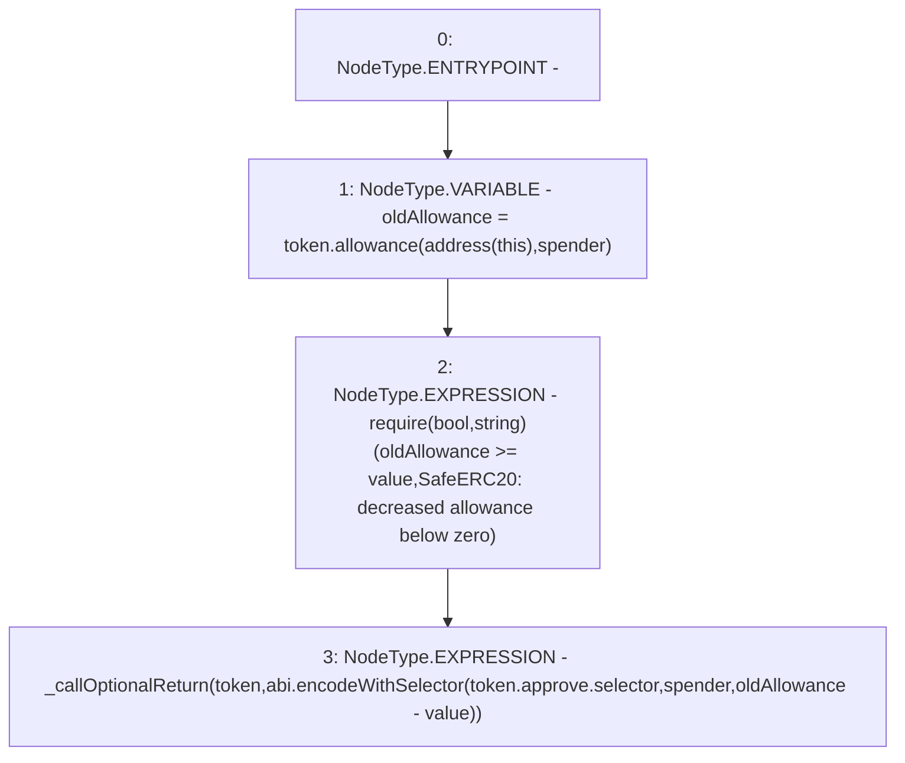

# Context: SafeERC20.safeDecreaseAllowance

**Contract:** `SafeERC20` (Inherits: None)
**Signature:** `safeDecreaseAllowance(IERC20,address,uint256)`
**Method Selector ID:** `Internal (No Method ID)`
**Visibility:** `internal`
**Environment-Free:** `Yes`
**Modifiers:** None

### State Variables Interaction
- **Reads:** None
- **Writes:** None

### Assertion Checks & Business Requirements
- require/assert: `require(bool,string)(oldAllowance >= value,SafeERC20: decreased allowance below zero)`

### Environment & Verification Flags
- **Uses Foundry Cheatcodes:** No
- **Has Echidna Properties:** No

### Internal Calls Tree
- None

### External Calls / Value Transfers
- `IERC20.TMP_34(uint256) = HIGH_LEVEL_CALL, dest:token(IERC20), function:allowance, arguments:['TMP_33', 'spender']  `

### Control Flow Graph (CFG)


### Source Mapping
Declared in: `certora-ac-datasets/detasets/web3bugs/dataset/web3bugs/52/node_modules/@openzeppelin/contracts/token/ERC20/utils/SafeERC20.sol` on lines **69** to **75**

```solidity
    function safeDecreaseAllowance(IERC20 token, address spender, uint256 value) internal {
        unchecked {
            uint256 oldAllowance = token.allowance(address(this), spender);
            require(oldAllowance >= value, "SafeERC20: decreased allowance below zero");
            _callOptionalReturn(token, abi.encodeWithSelector(token.approve.selector, spender, oldAllowance - value));
        }
    }

```
