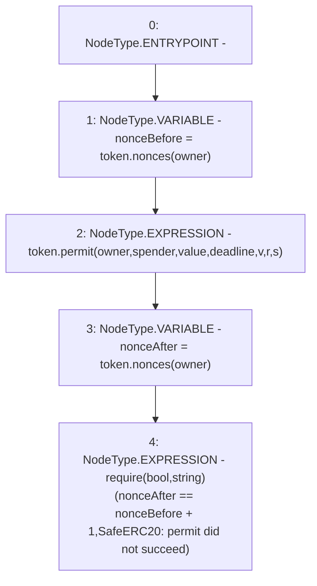

# Context: SafeERC20.safePermit

**Contract:** `SafeERC20` (Inherits: None)
**Signature:** `safePermit(IERC20Permit,address,address,uint256,uint256,uint8,bytes32,bytes32)`
**Method Selector ID:** `Internal (No Method ID)`
**Visibility:** `internal`
**Environment-Free:** `Yes`
**Modifiers:** None

### State Variables Interaction
- **Reads:** None
- **Writes:** None

### Assertion Checks & Business Requirements
- require/assert: `require(bool,string)(nonceAfter == nonceBefore + 1,SafeERC20: permit did not succeed)`

### Environment & Verification Flags
- **Uses Foundry Cheatcodes:** No
- **Has Echidna Properties:** No

### Internal Calls Tree
- None

### External Calls / Value Transfers
- `IERC20Permit.HIGH_LEVEL_CALL, dest:token(IERC20Permit), function:permit, arguments:['owner', 'spender', 'value', 'deadline', 'v', 'r', 's']  `
- `IERC20Permit.TMP_48(uint256) = HIGH_LEVEL_CALL, dest:token(IERC20Permit), function:nonces, arguments:['owner']  `
- `IERC20Permit.TMP_46(uint256) = HIGH_LEVEL_CALL, dest:token(IERC20Permit), function:nonces, arguments:['owner']  `

### Control Flow Graph (CFG)


### Source Mapping
Declared in: `certora-ac-datasets/detasets/web3bugs/dataset/web3bugs/52/node_modules/@openzeppelin/contracts/token/ERC20/utils/SafeERC20.sol` on lines **95** to **109**

```solidity
    function safePermit(
        IERC20Permit token,
        address owner,
        address spender,
        uint256 value,
        uint256 deadline,
        uint8 v,
        bytes32 r,
        bytes32 s
    ) internal {
        uint256 nonceBefore = token.nonces(owner);
        token.permit(owner, spender, value, deadline, v, r, s);
        uint256 nonceAfter = token.nonces(owner);
        require(nonceAfter == nonceBefore + 1, "SafeERC20: permit did not succeed");
    }

```
