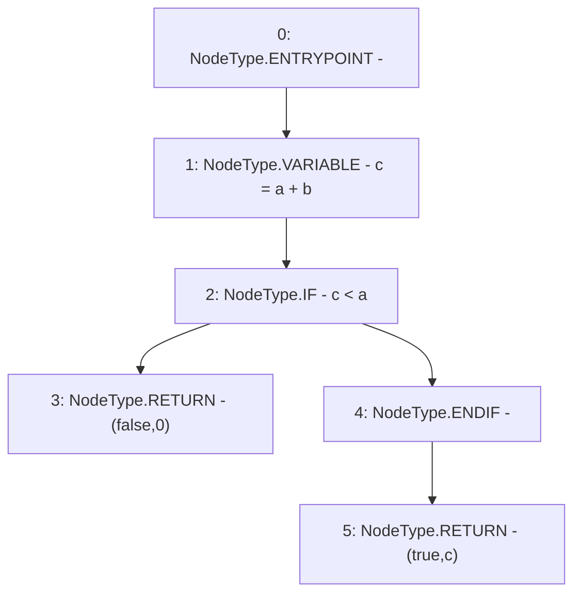

# Context: SafeMath.tryAdd

**Contract:** `SafeMath` (Inherits: None)
**Signature:** `tryAdd(uint256,uint256) returns (bool, uint256)`
**Method Selector ID:** `Internal (No Method ID)`
**Visibility:** `internal`
**Environment-Free:** `Yes`
**Modifiers:** None

### State Variables Interaction
- **Reads:** None
- **Writes:** None

### Environment & Verification Flags
- **Uses Foundry Cheatcodes:** No
- **Has Echidna Properties:** No

### Internal Calls Tree
- None

### External Calls / Value Transfers
- None

### Control Flow Graph (CFG)


### Source Mapping
Declared in: `certora-ac-datasets/detasets/web3bugs/dataset/web3bugs/52/node_modules/@openzeppelin/contracts/utils/math/SafeMath.sol` on lines **22** to **28**

```solidity
    function tryAdd(uint256 a, uint256 b) internal pure returns (bool, uint256) {
        unchecked {
            uint256 c = a + b;
            if (c < a) return (false, 0);
            return (true, c);
        }
    }

```
