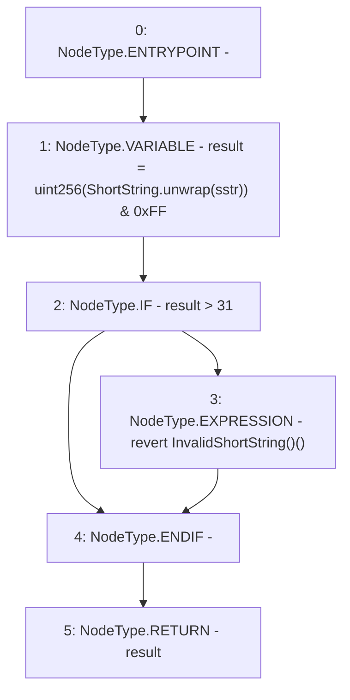

# Context: ShortStrings.byteLength

**Contract:** `ShortStrings` (Inherits: None)
**Signature:** `byteLength(ShortString) returns (uint256)`
**Method Selector ID:** `Internal (No Method ID)`
**Visibility:** `internal`
**Environment-Free:** `Yes`
**Modifiers:** None

### State Variables Interaction
- **Reads:** None
- **Writes:** None

### Assertion Checks & Business Requirements
- revert: `revert InvalidShortString()()`

### Environment & Verification Flags
- **Uses Foundry Cheatcodes:** No
- **Has Echidna Properties:** No

### Internal Calls Tree
- None

### External Calls / Value Transfers
- None

### Control Flow Graph (CFG)


### Source Mapping
Declared in: `certora-ac-datasets/detasets/web3bugs/dataset/web3bugs/52/node_modules/@openzeppelin/contracts/utils/ShortStrings.sol` on lines **78** to **84**

```solidity
    function byteLength(ShortString sstr) internal pure returns (uint256) {
        uint256 result = uint256(ShortString.unwrap(sstr)) & 0xFF;
        if (result > 31) {
            revert InvalidShortString();
        }
        return result;
    }

```
