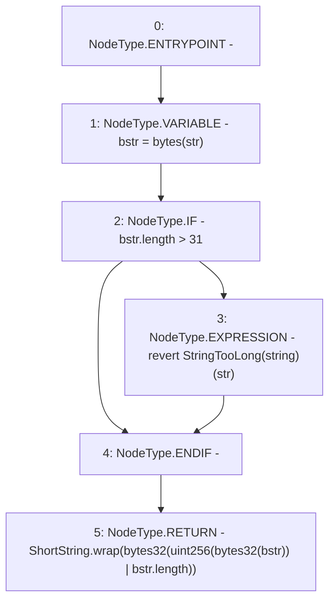

# Context: ShortStrings.toShortString

**Contract:** `ShortStrings` (Inherits: None)
**Signature:** `toShortString(string) returns (ShortString)`
**Method Selector ID:** `Internal (No Method ID)`
**Visibility:** `internal`
**Environment-Free:** `Yes`
**Modifiers:** None

### State Variables Interaction
- **Reads:** None
- **Writes:** None

### Assertion Checks & Business Requirements
- revert: `revert StringTooLong(string)(str)`

### Environment & Verification Flags
- **Uses Foundry Cheatcodes:** No
- **Has Echidna Properties:** No

### Internal Calls Tree
- None

### External Calls / Value Transfers
- None

### Control Flow Graph (CFG)


### Source Mapping
Declared in: `certora-ac-datasets/detasets/web3bugs/dataset/web3bugs/52/node_modules/@openzeppelin/contracts/utils/ShortStrings.sol` on lines **52** to **58**

```solidity
    function toShortString(string memory str) internal pure returns (ShortString) {
        bytes memory bstr = bytes(str);
        if (bstr.length > 31) {
            revert StringTooLong(str);
        }
        return ShortString.wrap(bytes32(uint256(bytes32(bstr)) | bstr.length));
    }

```
