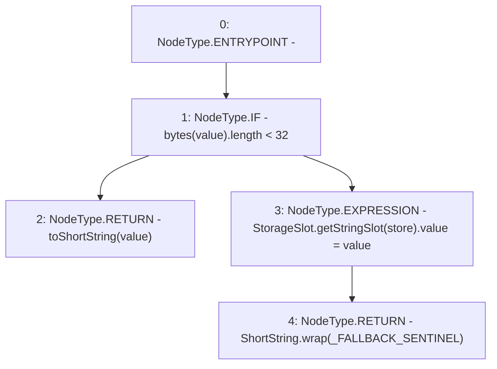

# Context: ShortStrings.toShortStringWithFallback

**Contract:** `ShortStrings` (Inherits: None)
**Signature:** `toShortStringWithFallback(string,string) returns (ShortString)`
**Method Selector ID:** `Internal (No Method ID)`
**Visibility:** `internal`
**Environment-Free:** `Yes`
**Modifiers:** None

### State Variables Interaction
- **Reads:** _FALLBACK_SENTINEL
- **Writes:** None

### Environment & Verification Flags
- **Uses Foundry Cheatcodes:** No
- **Has Echidna Properties:** No

### Internal Calls Tree
- None

### External Calls / Value Transfers
- `StorageSlot.TMP_395(StorageSlot.StringSlot) = LIBRARY_CALL, dest:StorageSlot, function:StorageSlot.getStringSlot(string), arguments:['store'] `

### Control Flow Graph (CFG)


### Source Mapping
Declared in: `certora-ac-datasets/detasets/web3bugs/dataset/web3bugs/52/node_modules/@openzeppelin/contracts/utils/ShortStrings.sol` on lines **89** to **96**

```solidity
    function toShortStringWithFallback(string memory value, string storage store) internal returns (ShortString) {
        if (bytes(value).length < 32) {
            return toShortString(value);
        } else {
            StorageSlot.getStringSlot(store).value = value;
            return ShortString.wrap(_FALLBACK_SENTINEL);
        }
    }

```
