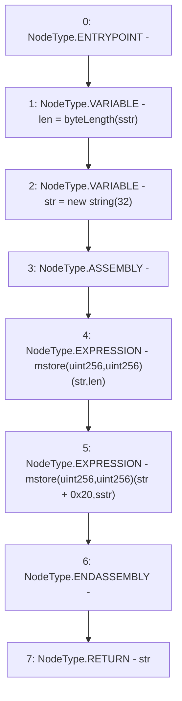

# Context: ShortStrings.toString

**Contract:** `ShortStrings` (Inherits: None)
**Signature:** `toString(ShortString) returns (string)`
**Method Selector ID:** `Internal (No Method ID)`
**Visibility:** `internal`
**Environment-Free:** `Yes`
**Modifiers:** None

### State Variables Interaction
- **Reads:** None
- **Writes:** None

### Environment & Verification Flags
- **Uses Foundry Cheatcodes:** No
- **Has Echidna Properties:** No

### Internal Calls Tree
- None

### External Calls / Value Transfers
- None

### Control Flow Graph (CFG)


### Source Mapping
Declared in: `certora-ac-datasets/detasets/web3bugs/dataset/web3bugs/52/node_modules/@openzeppelin/contracts/utils/ShortStrings.sol` on lines **63** to **73**

```solidity
    function toString(ShortString sstr) internal pure returns (string memory) {
        uint256 len = byteLength(sstr);
        // using `new string(len)` would work locally but is not memory safe.
        string memory str = new string(32);
        /// @solidity memory-safe-assembly
        assembly {
            mstore(str, len)
            mstore(add(str, 0x20), sstr)
        }
        return str;
    }

```
