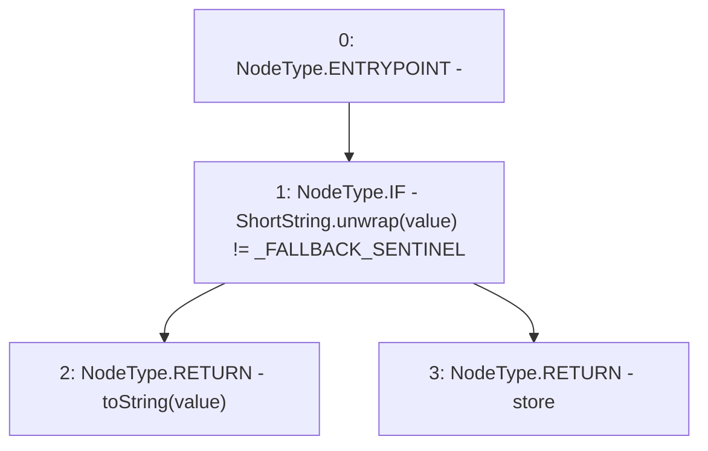

# Context: ShortStrings.toStringWithFallback

**Contract:** `ShortStrings` (Inherits: None)
**Signature:** `toStringWithFallback(ShortString,string) returns (string)`
**Method Selector ID:** `Internal (No Method ID)`
**Visibility:** `internal`
**Environment-Free:** `Yes`
**Modifiers:** None

### State Variables Interaction
- **Reads:** _FALLBACK_SENTINEL
- **Writes:** None

### Environment & Verification Flags
- **Uses Foundry Cheatcodes:** No
- **Has Echidna Properties:** No

### Internal Calls Tree
- None

### External Calls / Value Transfers
- None

### Control Flow Graph (CFG)


### Source Mapping
Declared in: `certora-ac-datasets/detasets/web3bugs/dataset/web3bugs/52/node_modules/@openzeppelin/contracts/utils/ShortStrings.sol` on lines **101** to **107**

```solidity
    function toStringWithFallback(ShortString value, string storage store) internal pure returns (string memory) {
        if (ShortString.unwrap(value) != _FALLBACK_SENTINEL) {
            return toString(value);
        } else {
            return store;
        }
    }

```
