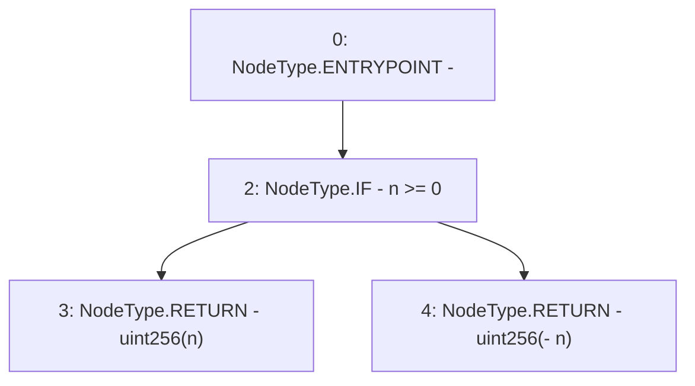

# Context: SignedMath.abs

**Contract:** `SignedMath` (Inherits: None)
**Signature:** `abs(int256) returns (uint256)`
**Method Selector ID:** `Internal (No Method ID)`
**Visibility:** `internal`
**Environment-Free:** `Yes`
**Modifiers:** None

### State Variables Interaction
- **Reads:** None
- **Writes:** None

### Environment & Verification Flags
- **Uses Foundry Cheatcodes:** No
- **Has Echidna Properties:** No

### Internal Calls Tree
- None

### External Calls / Value Transfers
- None

### Control Flow Graph (CFG)


### Source Mapping
Declared in: `certora-ac-datasets/detasets/web3bugs/dataset/web3bugs/52/node_modules/@openzeppelin/contracts/utils/math/SignedMath.sol` on lines **37** to **42**

```solidity
    function abs(int256 n) internal pure returns (uint256) {
        unchecked {
            // must be unchecked in order to support `n = type(int256).min`
            return uint256(n >= 0 ? n : -n);
        }
    }

```
