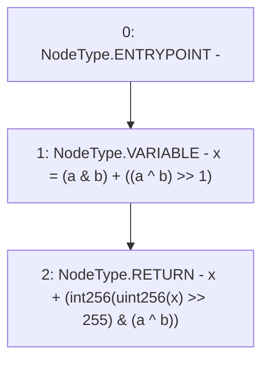

# Context: SignedMath.average

**Contract:** `SignedMath` (Inherits: None)
**Signature:** `average(int256,int256) returns (int256)`
**Method Selector ID:** `Internal (No Method ID)`
**Visibility:** `internal`
**Environment-Free:** `Yes`
**Modifiers:** None

### State Variables Interaction
- **Reads:** None
- **Writes:** None

### Environment & Verification Flags
- **Uses Foundry Cheatcodes:** No
- **Has Echidna Properties:** No

### Internal Calls Tree
- None

### External Calls / Value Transfers
- None

### Control Flow Graph (CFG)


### Source Mapping
Declared in: `certora-ac-datasets/detasets/web3bugs/dataset/web3bugs/52/node_modules/@openzeppelin/contracts/utils/math/SignedMath.sol` on lines **28** to **32**

```solidity
    function average(int256 a, int256 b) internal pure returns (int256) {
        // Formula from the book "Hacker's Delight"
        int256 x = (a & b) + ((a ^ b) >> 1);
        return x + (int256(uint256(x) >> 255) & (a ^ b));
    }

```
