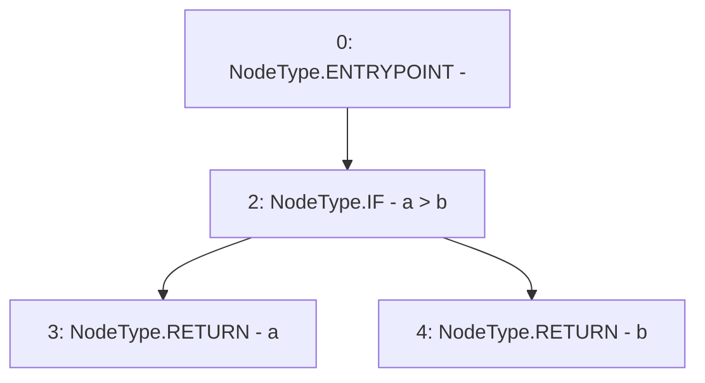

# Context: SignedMath.max

**Contract:** `SignedMath` (Inherits: None)
**Signature:** `max(int256,int256) returns (int256)`
**Method Selector ID:** `Internal (No Method ID)`
**Visibility:** `internal`
**Environment-Free:** `Yes`
**Modifiers:** None

### State Variables Interaction
- **Reads:** None
- **Writes:** None

### Environment & Verification Flags
- **Uses Foundry Cheatcodes:** No
- **Has Echidna Properties:** No

### Internal Calls Tree
- None

### External Calls / Value Transfers
- None

### Control Flow Graph (CFG)


### Source Mapping
Declared in: `certora-ac-datasets/detasets/web3bugs/dataset/web3bugs/52/node_modules/@openzeppelin/contracts/utils/math/SignedMath.sol` on lines **13** to **15**

```solidity
    function max(int256 a, int256 b) internal pure returns (int256) {
        return a > b ? a : b;
    }

```
