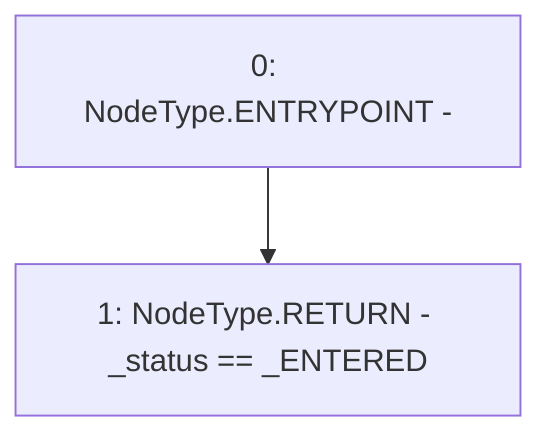

# Context: StakingRewards._reentrancyGuardEntered

**Contract:** `StakingRewards` (Inherits: Pausable, ReentrancyGuard, RewardsDistributionRecipient, Owned, IStakingRewards)
**Signature:** `_reentrancyGuardEntered() returns (bool)`
**Method Selector ID:** `Internal (No Method ID)`
**Visibility:** `internal`
**Environment-Free:** `Yes`
**Modifiers:** None

### State Variables Interaction
- **Reads:** _ENTERED, _status
- **Writes:** None

### Environment & Verification Flags
- **Uses Foundry Cheatcodes:** No
- **Has Echidna Properties:** No

### Internal Calls Tree
- None

### External Calls / Value Transfers
- None

### Control Flow Graph (CFG)


### Source Mapping
Declared in: `certora-ac-datasets/detasets/web3bugs/dataset/web3bugs/52/node_modules/@openzeppelin/contracts/security/ReentrancyGuard.sol` on lines **74** to **76**

```solidity
    function _reentrancyGuardEntered() internal view returns (bool) {
        return _status == _ENTERED;
    }

```
