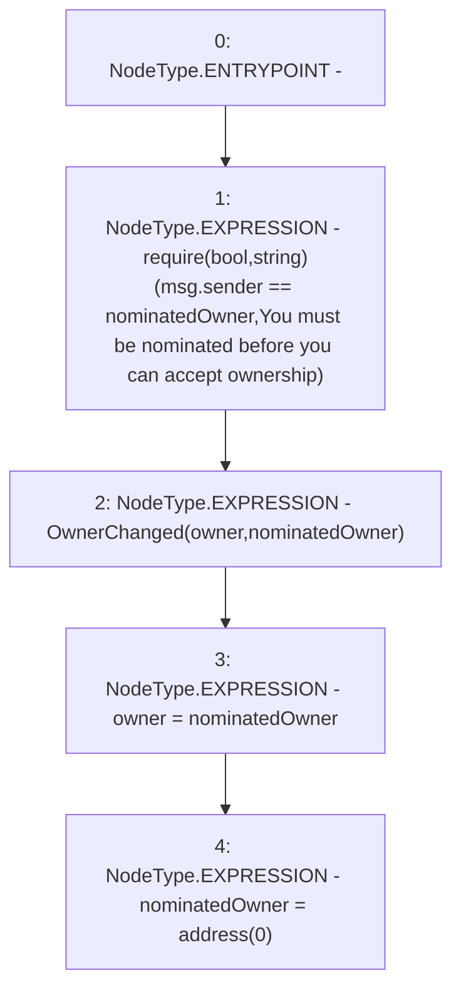

# Context: StakingRewards.acceptOwnership

**Contract:** `StakingRewards` (Inherits: Pausable, ReentrancyGuard, RewardsDistributionRecipient, Owned, IStakingRewards)
**Signature:** `acceptOwnership()`
**Method Selector ID:** `0x79ba5097`
**Visibility:** `external`
**Environment-Free:** `No (reads EVM state context)`
**Modifiers:** None

### State Variables Interaction
- **Reads:** nominatedOwner, owner
- **Writes:** nominatedOwner, owner

### Assertion Checks & Business Requirements
- require/assert: `require(bool,string)(msg.sender == nominatedOwner,You must be nominated before you can accept ownership)`

### Environment & Verification Flags
- **Uses Foundry Cheatcodes:** No
- **Has Echidna Properties:** No

### Internal Calls Tree
- None

### External Calls / Value Transfers
- None

### Control Flow Graph (CFG)


### Source Mapping
Declared in: `certora-ac-datasets/detasets/web3bugs/dataset/web3bugs/52/contracts/staking-rewards/Owned.sol` on lines **19** to **24**

```solidity
    function acceptOwnership() external {
        require(msg.sender == nominatedOwner, "You must be nominated before you can accept ownership");
        emit OwnerChanged(owner, nominatedOwner);
        owner = nominatedOwner;
        nominatedOwner = address(0);
    }

```
