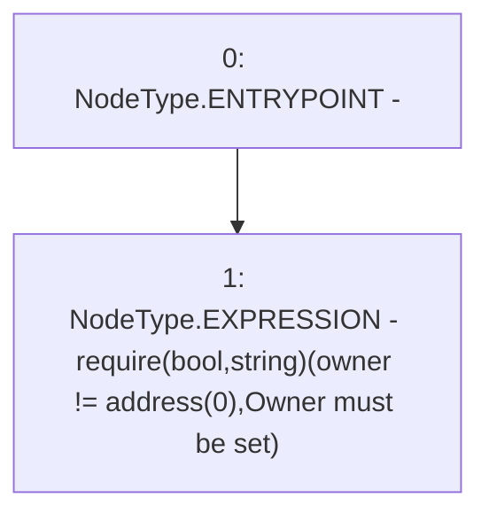

# Context: StakingRewards.constructor

**Contract:** `StakingRewards` (Inherits: Pausable, ReentrancyGuard, RewardsDistributionRecipient, Owned, IStakingRewards)
**Signature:** `constructor()`
**Method Selector ID:** `Internal (No Method ID)`
**Visibility:** `internal`
**Environment-Free:** `Yes`
**Modifiers:** None

### State Variables Interaction
- **Reads:** owner
- **Writes:** None

### Assertion Checks & Business Requirements
- require/assert: `require(bool,string)(owner != address(0),Owner must be set)`

### Environment & Verification Flags
- **Uses Foundry Cheatcodes:** No
- **Has Echidna Properties:** No

### Internal Calls Tree
- None

### External Calls / Value Transfers
- None

### Control Flow Graph (CFG)


### Source Mapping
Declared in: `certora-ac-datasets/detasets/web3bugs/dataset/web3bugs/52/contracts/staking-rewards/Pausable.sol` on lines **10** to **14**

```solidity
    constructor() {
        // This contract is abstract, and thus cannot be instantiated directly
        require(owner != address(0), "Owner must be set");
        // Paused will be false, and lastPauseTime will be 0 upon initialisation
    }

```
