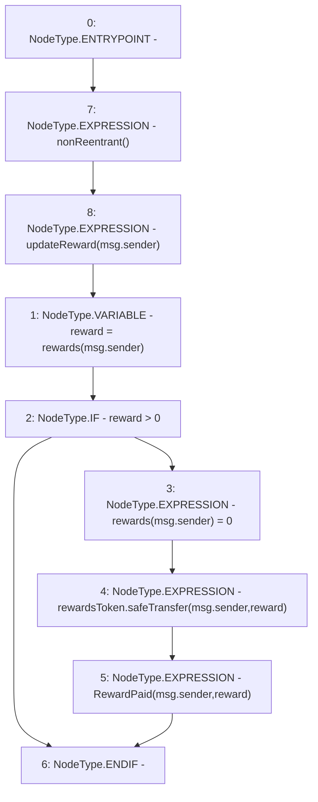

# Context: StakingRewards.getReward

**Contract:** `StakingRewards` (Inherits: Pausable, ReentrancyGuard, RewardsDistributionRecipient, Owned, IStakingRewards)
**Signature:** `getReward()`
**Method Selector ID:** `0x3d18b912`
**Visibility:** `public`
**Environment-Free:** `No (reads EVM state context)`
**Modifiers:**
- `nonReentrant`
  ```solidity
  modifier nonReentrant() {
          _nonReentrantBefore();
          _;
          _nonReentrantAfter();
      }
  ```
- `updateReward`
  ```solidity
  modifier updateReward(address account) {
          rewardPerTokenStored = rewardPerToken();
          lastUpdateTime = lastTimeRewardApplicable();
          if (account != address(0)) {
              rewards[account] = earned(account);
              userRewardPerTokenPaid[account] = rewardPerTokenStored;
          }
          _;
      }
  ```

### State Variables Interaction
- **Reads:** rewards, rewardsToken
- **Writes:** rewards

### Environment & Verification Flags
- **Uses Foundry Cheatcodes:** No
- **Has Echidna Properties:** No

### Internal Calls Tree
- None

### External Calls / Value Transfers
- `SafeERC20.LIBRARY_CALL, dest:SafeERC20, function:SafeERC20.safeTransfer(IERC20,address,uint256), arguments:['rewardsToken', 'msg.sender', 'reward'] `

### Control Flow Graph (CFG)


### Source Mapping
Declared in: `certora-ac-datasets/detasets/web3bugs/dataset/web3bugs/52/contracts/staking-rewards/StakingRewards.sol` on lines **111** to **118**

```solidity
    function getReward() public nonReentrant updateReward(msg.sender) {
        uint reward = rewards[msg.sender];
        if (reward > 0) {
            rewards[msg.sender] = 0;
            rewardsToken.safeTransfer(msg.sender, reward);
            emit RewardPaid(msg.sender, reward);
        }
    }

```
