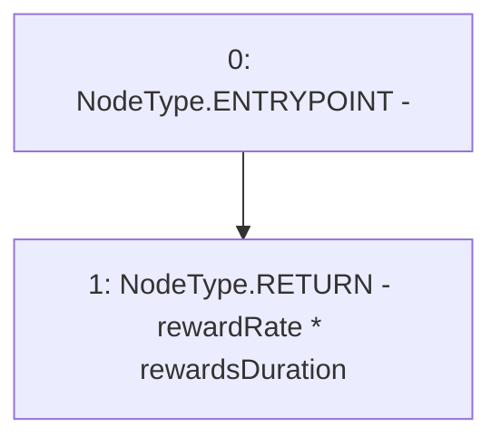

# Context: StakingRewards.getRewardForDuration

**Contract:** `StakingRewards` (Inherits: Pausable, ReentrancyGuard, RewardsDistributionRecipient, Owned, IStakingRewards)
**Signature:** `getRewardForDuration() returns (uint256)`
**Method Selector ID:** `0x1c1f78eb`
**Visibility:** `external`
**Environment-Free:** `Yes`
**Modifiers:** None

### State Variables Interaction
- **Reads:** rewardRate, rewardsDuration
- **Writes:** None

### Environment & Verification Flags
- **Uses Foundry Cheatcodes:** No
- **Has Echidna Properties:** No

### Internal Calls Tree
- None

### External Calls / Value Transfers
- None

### Control Flow Graph (CFG)


### Source Mapping
Declared in: `certora-ac-datasets/detasets/web3bugs/dataset/web3bugs/52/contracts/staking-rewards/StakingRewards.sol` on lines **84** to **86**

```solidity
    function getRewardForDuration() external view returns (uint) {
        return rewardRate * rewardsDuration;
    }

```
