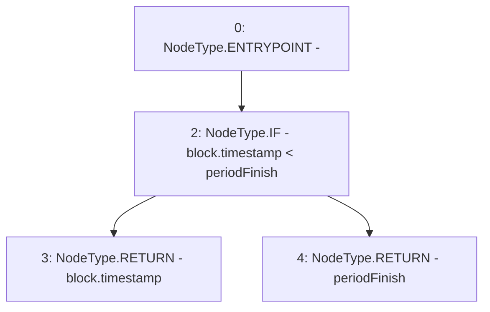

# Context: StakingRewards.lastTimeRewardApplicable

**Contract:** `StakingRewards` (Inherits: Pausable, ReentrancyGuard, RewardsDistributionRecipient, Owned, IStakingRewards)
**Signature:** `lastTimeRewardApplicable() returns (uint256)`
**Method Selector ID:** `0x80faa57d`
**Visibility:** `public`
**Environment-Free:** `No (reads EVM state context)`
**Modifiers:** None

### State Variables Interaction
- **Reads:** periodFinish
- **Writes:** None

### Environment & Verification Flags
- **Uses Foundry Cheatcodes:** No
- **Has Echidna Properties:** No

### Internal Calls Tree
- None

### External Calls / Value Transfers
- None

### Control Flow Graph (CFG)


### Source Mapping
Declared in: `certora-ac-datasets/detasets/web3bugs/dataset/web3bugs/52/contracts/staking-rewards/StakingRewards.sol` on lines **63** to **65**

```solidity
    function lastTimeRewardApplicable() public view returns (uint) {
        return block.timestamp < periodFinish ? block.timestamp : periodFinish;
    }

```
