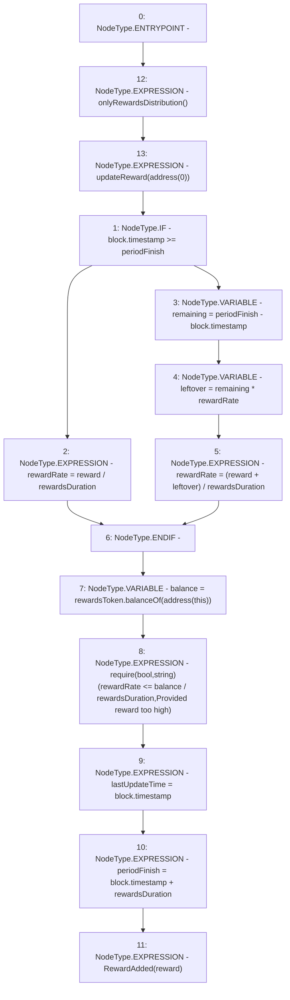

# Context: StakingRewards.notifyRewardAmount

**Contract:** `StakingRewards` (Inherits: Pausable, ReentrancyGuard, RewardsDistributionRecipient, Owned, IStakingRewards)
**Signature:** `notifyRewardAmount(uint256)`
**Method Selector ID:** `0x3c6b16ab`
**Visibility:** `external`
**Environment-Free:** `No (reads EVM state context)`
**Modifiers:**
- `onlyRewardsDistribution`
  ```solidity
  modifier onlyRewardsDistribution() {
          require(msg.sender == rewardsDistribution, "not reward distribution");
          _;
      }
  ```
- `updateReward`
  ```solidity
  modifier updateReward(address account) {
          rewardPerTokenStored = rewardPerToken();
          lastUpdateTime = lastTimeRewardApplicable();
          if (account != address(0)) {
              rewards[account] = earned(account);
              userRewardPerTokenPaid[account] = rewardPerTokenStored;
          }
          _;
      }
  ```

### State Variables Interaction
- **Reads:** periodFinish, rewardRate, rewardsDuration, rewardsToken
- **Writes:** lastUpdateTime, periodFinish, rewardRate

### Assertion Checks & Business Requirements
- require/assert: `require(bool,string)(rewardRate <= balance / rewardsDuration,Provided reward too high)`

### Environment & Verification Flags
- **Uses Foundry Cheatcodes:** No
- **Has Echidna Properties:** No

### Internal Calls Tree
- None

### External Calls / Value Transfers
- `IERC20.TMP_214(uint256) = HIGH_LEVEL_CALL, dest:rewardsToken(IERC20), function:balanceOf, arguments:['TMP_213']  `

### Control Flow Graph (CFG)


### Source Mapping
Declared in: `certora-ac-datasets/detasets/web3bugs/dataset/web3bugs/52/contracts/staking-rewards/StakingRewards.sol` on lines **127** to **150**

```solidity
    function notifyRewardAmount(uint reward)
        external
        override
        onlyRewardsDistribution
        updateReward(address(0))
    {
        if (block.timestamp >= periodFinish) {
            rewardRate = reward / rewardsDuration;
        } else {
            uint remaining = periodFinish - block.timestamp;
            uint leftover = remaining * rewardRate;
            rewardRate = (reward + leftover) / rewardsDuration;
        }
        // Ensure the provided reward amount is not more than the balance in the contract.
        // This keeps the reward rate in the right range, preventing overflows due to
        // very high values of rewardRate in the earned and rewardsPerToken functions;
        // Reward + leftover must be less than 2^256 / 10^18 to avoid overflow.
        uint balance = rewardsToken.balanceOf(address(this));
        require(rewardRate <= balance / rewardsDuration, "Provided reward too high");

        lastUpdateTime = block.timestamp;
        periodFinish = block.timestamp + rewardsDuration;
        emit RewardAdded(reward);
    }

```
