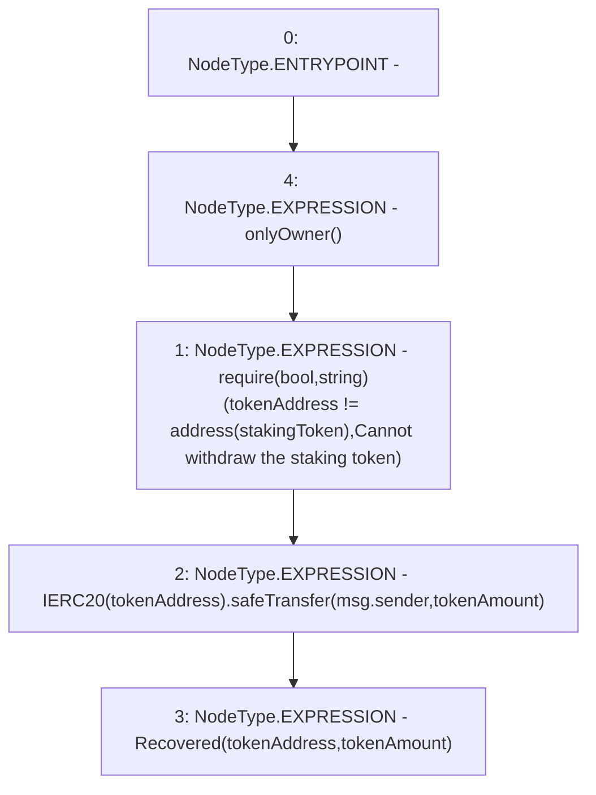

# Context: StakingRewards.recoverERC20

**Contract:** `StakingRewards` (Inherits: Pausable, ReentrancyGuard, RewardsDistributionRecipient, Owned, IStakingRewards)
**Signature:** `recoverERC20(address,uint256)`
**Method Selector ID:** `0x8980f11f`
**Visibility:** `external`
**Environment-Free:** `No (reads EVM state context)`
**Modifiers:**
- `onlyOwner`
  ```solidity
  modifier onlyOwner {
          _onlyOwner();
          _;
      }
  ```

### State Variables Interaction
- **Reads:** stakingToken
- **Writes:** None

### Assertion Checks & Business Requirements
- require/assert: `require(bool,string)(tokenAddress != address(stakingToken),Cannot withdraw the staking token)`

### Environment & Verification Flags
- **Uses Foundry Cheatcodes:** No
- **Has Echidna Properties:** No

### Internal Calls Tree
- None

### External Calls / Value Transfers
- `SafeERC20.LIBRARY_CALL, dest:SafeERC20, function:SafeERC20.safeTransfer(IERC20,address,uint256), arguments:['TMP_226', 'msg.sender', 'tokenAmount'] `

### Control Flow Graph (CFG)


### Source Mapping
Declared in: `certora-ac-datasets/detasets/web3bugs/dataset/web3bugs/52/contracts/staking-rewards/StakingRewards.sol` on lines **153** to **160**

```solidity
    function recoverERC20(address tokenAddress, uint tokenAmount) external onlyOwner {
        require(
            tokenAddress != address(stakingToken),
            "Cannot withdraw the staking token"
        );
        IERC20(tokenAddress).safeTransfer(msg.sender, tokenAmount);
        emit Recovered(tokenAddress, tokenAmount);
    }

```
