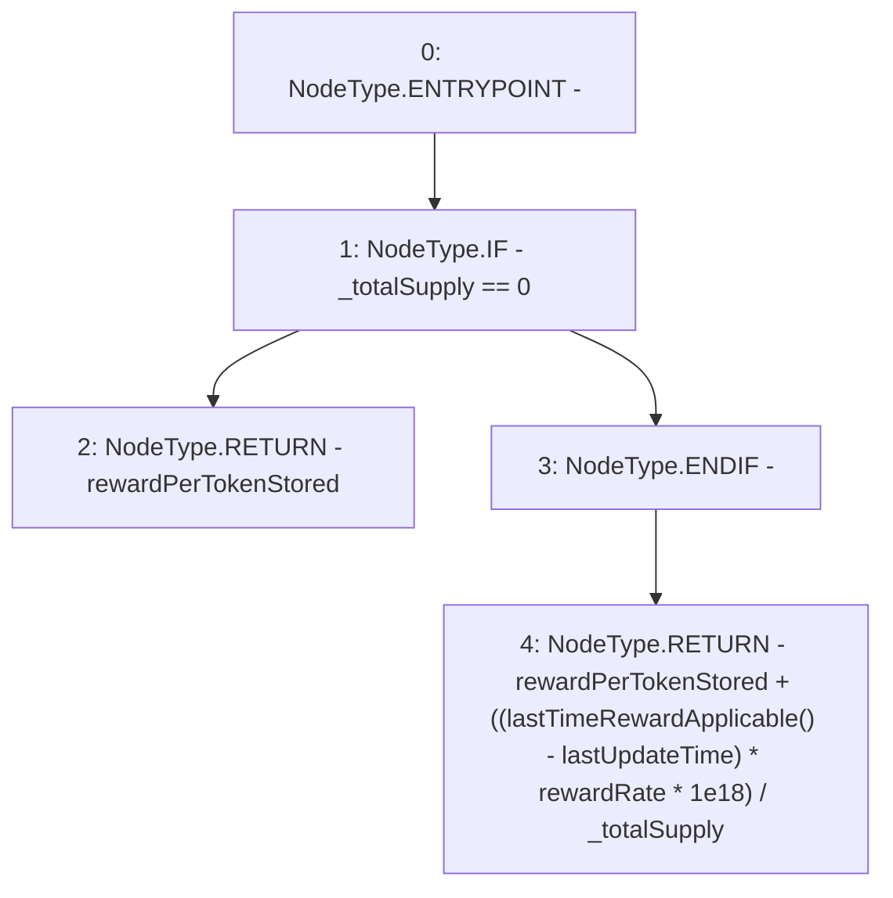

# Context: StakingRewards.rewardPerToken

**Contract:** `StakingRewards` (Inherits: Pausable, ReentrancyGuard, RewardsDistributionRecipient, Owned, IStakingRewards)
**Signature:** `rewardPerToken() returns (uint256)`
**Method Selector ID:** `0xcd3daf9d`
**Visibility:** `public`
**Environment-Free:** `No (reads EVM state context)`
**Modifiers:** None

### State Variables Interaction
- **Reads:** _totalSupply, lastUpdateTime, rewardPerTokenStored, rewardRate
- **Writes:** None

### Environment & Verification Flags
- **Uses Foundry Cheatcodes:** No
- **Has Echidna Properties:** No

### Internal Calls Tree
- None

### External Calls / Value Transfers
- None

### Control Flow Graph (CFG)


### Source Mapping
Declared in: `certora-ac-datasets/detasets/web3bugs/dataset/web3bugs/52/contracts/staking-rewards/StakingRewards.sol` on lines **67** to **75**

```solidity
    function rewardPerToken() public view returns (uint) {
        if (_totalSupply == 0) {
            return rewardPerTokenStored;
        }
        return
            rewardPerTokenStored +
            ((lastTimeRewardApplicable() - lastUpdateTime) * rewardRate * 1e18) /
            _totalSupply;
    }

```
