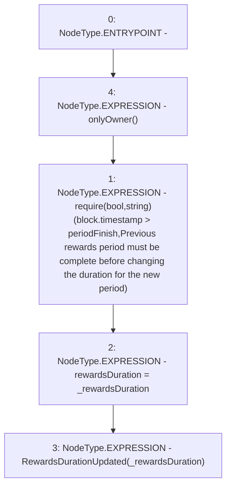

# Context: StakingRewards.setRewardsDuration

**Contract:** `StakingRewards` (Inherits: Pausable, ReentrancyGuard, RewardsDistributionRecipient, Owned, IStakingRewards)
**Signature:** `setRewardsDuration(uint256)`
**Method Selector ID:** `0xcc1a378f`
**Visibility:** `external`
**Environment-Free:** `No (reads EVM state context)`
**Modifiers:**
- `onlyOwner`
  ```solidity
  modifier onlyOwner {
          _onlyOwner();
          _;
      }
  ```

### State Variables Interaction
- **Reads:** periodFinish
- **Writes:** rewardsDuration

### Assertion Checks & Business Requirements
- require/assert: `require(bool,string)(block.timestamp > periodFinish,Previous rewards period must be complete before changing the duration for the new period)`

### Environment & Verification Flags
- **Uses Foundry Cheatcodes:** No
- **Has Echidna Properties:** No

### Internal Calls Tree
- None

### External Calls / Value Transfers
- None

### Control Flow Graph (CFG)


### Source Mapping
Declared in: `certora-ac-datasets/detasets/web3bugs/dataset/web3bugs/52/contracts/staking-rewards/StakingRewards.sol` on lines **162** to **169**

```solidity
    function setRewardsDuration(uint _rewardsDuration) external onlyOwner {
        require(
            block.timestamp > periodFinish,
            "Previous rewards period must be complete before changing the duration for the new period"
        );
        rewardsDuration = _rewardsDuration;
        emit RewardsDurationUpdated(_rewardsDuration);
    }

```
