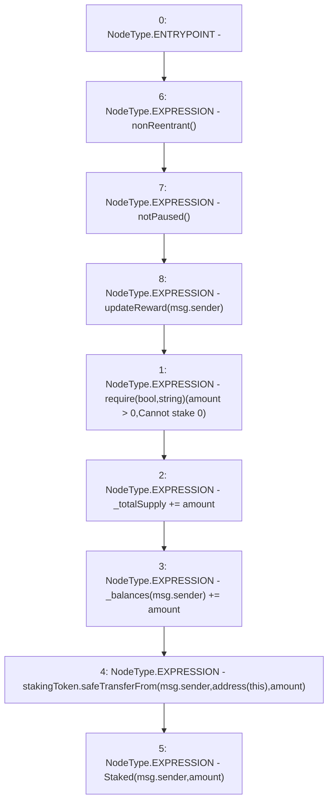

# Context: StakingRewards.stake

**Contract:** `StakingRewards` (Inherits: Pausable, ReentrancyGuard, RewardsDistributionRecipient, Owned, IStakingRewards)
**Signature:** `stake(uint256)`
**Method Selector ID:** `0xa694fc3a`
**Visibility:** `external`
**Environment-Free:** `No (reads EVM state context)`
**Modifiers:**
- `nonReentrant`
  ```solidity
  modifier nonReentrant() {
          _nonReentrantBefore();
          _;
          _nonReentrantAfter();
      }
  ```
- `notPaused`
  ```solidity
  modifier notPaused() {
          require(!paused, "paused");
          _;
      }
  ```
- `updateReward`
  ```solidity
  modifier updateReward(address account) {
          rewardPerTokenStored = rewardPerToken();
          lastUpdateTime = lastTimeRewardApplicable();
          if (account != address(0)) {
              rewards[account] = earned(account);
              userRewardPerTokenPaid[account] = rewardPerTokenStored;
          }
          _;
      }
  ```

### State Variables Interaction
- **Reads:** _balances, _totalSupply, stakingToken
- **Writes:** _balances, _totalSupply

### Assertion Checks & Business Requirements
- require/assert: `require(bool,string)(amount > 0,Cannot stake 0)`

### Environment & Verification Flags
- **Uses Foundry Cheatcodes:** No
- **Has Echidna Properties:** No

### Internal Calls Tree
- None

### External Calls / Value Transfers
- `SafeERC20.LIBRARY_CALL, dest:SafeERC20, function:SafeERC20.safeTransferFrom(IERC20,address,address,uint256), arguments:['stakingToken', 'msg.sender', 'TMP_188', 'amount'] `

### Control Flow Graph (CFG)


### Source Mapping
Declared in: `certora-ac-datasets/detasets/web3bugs/dataset/web3bugs/52/contracts/staking-rewards/StakingRewards.sol` on lines **90** to **101**

```solidity
    function stake(uint amount)
        external
        nonReentrant
        notPaused
        updateReward(msg.sender)
    {
        require(amount > 0, "Cannot stake 0");
        _totalSupply += amount;
        _balances[msg.sender] += amount;
        stakingToken.safeTransferFrom(msg.sender, address(this), amount);
        emit Staked(msg.sender, amount);
    }

```
