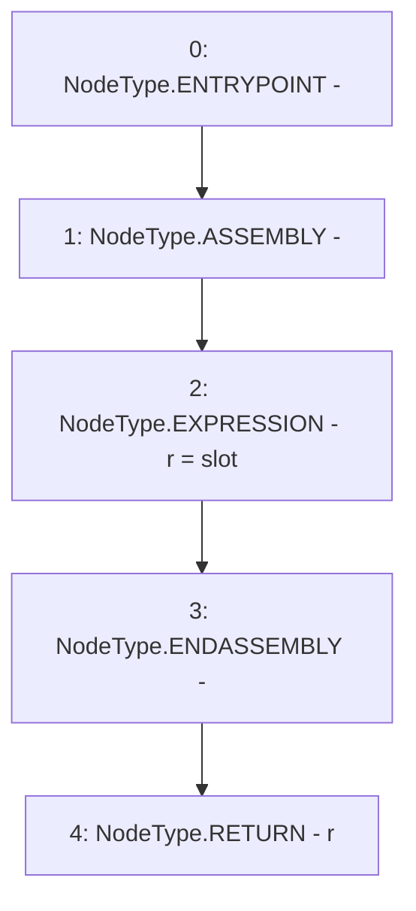

# Context: StorageSlot.getBytesSlot

**Contract:** `StorageSlot` (Inherits: None)
**Signature:** `getBytesSlot(bytes32) returns (StorageSlot.BytesSlot)`
**Method Selector ID:** `Internal (No Method ID)`
**Visibility:** `internal`
**Environment-Free:** `Yes`
**Modifiers:** None

### State Variables Interaction
- **Reads:** None
- **Writes:** None

### Environment & Verification Flags
- **Uses Foundry Cheatcodes:** No
- **Has Echidna Properties:** No

### Internal Calls Tree
- None

### External Calls / Value Transfers
- None

### Control Flow Graph (CFG)


### Source Mapping
Declared in: `certora-ac-datasets/detasets/web3bugs/dataset/web3bugs/52/node_modules/@openzeppelin/contracts/utils/StorageSlot.sol` on lines **122** to **127**

```solidity
    function getBytesSlot(bytes32 slot) internal pure returns (BytesSlot storage r) {
        /// @solidity memory-safe-assembly
        assembly {
            r.slot := slot
        }
    }

```
